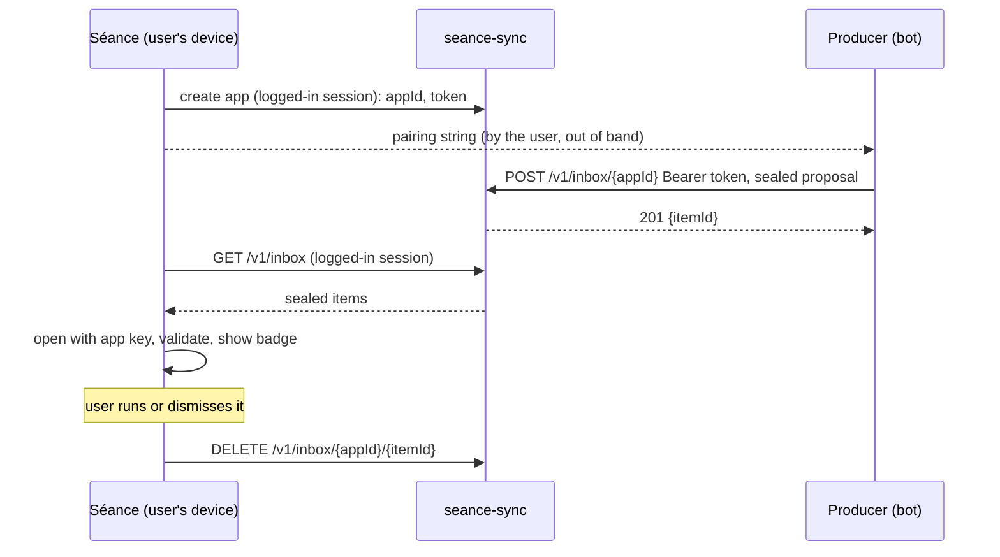

# Command inbox (design)

Status: implemented. The wire format is `seance_protocol`'s
`src/inbox/inbox.dart`, the client is `seance_core`'s `src/inbox/`, the
server is `seance_sync_server`'s `inbox_handlers.dart`. The app's parts
(Settings > Inbox, the banner, the review and staging) land separately,
after these. Where the code differs from the first draft of this
document, this document was updated to match.

## Problem

A user runs automation (LLM agents, scripts) on a machine that must not
touch production. The automation works out what should be done and wants
to hand the user a command for a production host. The user reviews it in
Séance and runs it, or does not. Concretely, from the discussion around
[PR #151](https://github.com/L-K-M/Seance/pull/151): bots on a dev VM see
scrubbed production errors and propose fixes; nothing a bot writes may
reach production without a human looking at it first.

Requirements:

- The producer never gets SSH access, vault access or any other way to
  act on a server. It can only *propose*.
- The user's machine does not have to be reachable. Laptops sit behind NAT
  and sleep.
- A proposal can be a multi-line script, names the host it is meant for
  and says why.
- What runs is byte for byte what the user reviewed.
- A breached sync server can neither read proposals nor forge them. The
  sync server is a breach-tolerant blob store (AGENTS.md, security model),
  and this feature must not weaken that.
- Nothing flows back to the producer except, at most, a status. Command
  output is production data.

PR #151 (snippet sources) solves part of this by polling a URL for a list
of one-line snippets. The inbox replaces that model: a proposal is a
request with a target and a reason, not a catalog entry, and it uses the
sync server both sides can already reach.

## Overview



An **app** is one producer the user has connected. Each app has:

- an `appId` (random, 128 bits, base64url), public;
- a **deposit token** (random, 256 bits), which the server checks. The
  server stores only a salted hash, as it does for the auth verifier;
- an **app key** (random, 256 bits, XChaCha20-Poly1305), which only the
  producer and the user's vault hold. The server never sees it.

The token decides what the server accepts. The key decides what Séance
believes. They have to be separate: a breached server can bypass its own
token check and write rows directly, and it sees every token in transit.
Only something the server never sees can prove to Séance that a proposal
came from the producer. Authenticated encryption under a key shared by the
producer and the vault gives confidentiality and that proof with one
primitive, the same cipher the vault already uses (`VaultCrypto`).

Considered and rejected: sealing to a vault public key plus an Ed25519
signature per app. It gives the same guarantees with three primitives
instead of one, and libsodium's sealed box has no counterpart in the
`cryptography` package. Its one advantage, that the producer cannot read
its own earlier proposals, protects nothing: it wrote them.

## Setup

Settings > Inbox > Connect an app:

1. The user names the app and may restrict it to a set of servers (by
   Séance server id; the default is any server).
2. Séance generates `appId`, the token and the key, and registers the app
   with `POST /v1/apps` over the logged-in session, sending `appId`, the
   display name and the token (the server salts and hashes it on receipt).
3. Séance stores the app as an `inboxApp` vault record (see Sync) and
   shows the **pairing string** once, with a copy button and a paragraph
   of instructions to paste into the agent's configuration.

Pairing string: `seance-inbox:` followed by base64url (no padding) of

```json
{"v": 1, "url": "https://sync.example.com", "app": "<appId>",
 "token": "<base64url>", "key": "<base64url>",
 "docs": "https://sync.example.com/llms.txt"}
```

It is a credential. Séance shows it once. Losing it means removing the app
and adding it again, which is also how a leak is handled.

Removing an app: `DELETE /v1/apps/{appId}` (drops the token hash and all
pending items) first, then a sealed `inboxApp` record marked removed and
carrying no key, so every device forgets the key. Not a tombstone:
tombstones are unsealed, so a sync server could forge one and drop an app
on every device. A removal is final; a live copy of a removed app is never
adopted again.

On a device, the app's name and server list are in `inbox_apps.json` and
its key is a vault entry, `inbox-key:<appId>`, so it is sealed like every
other credential and survives a vault re-key.

## Proposal format (version 1)

Plaintext, UTF-8 JSON:

```json
{
  "v": 1,
  "id": "0b6f2c1e-3f0a-4d8e-9d55-2d2b7e0f8a41",
  "host": "prod-db-1",
  "title": "Restart stuck queue worker",
  "reason": "Backlog since 09:12; worker 3 logs 'lease lost' in a loop.",
  "script": "systemctl restart queue-worker@3\nsystemctl status queue-worker@3 --no-pager",
  "created": 1790667579,
  "expires": 1790753979
}
```

| Field | Rule |
|---|---|
| `v` | Must be 1. Anything else is rejected, not guessed at. |
| `id` | Producer-chosen, 1 to 64 chars `[A-Za-z0-9._-]`. Unique per app, enforced by the client (the server cannot see it): a repeat of a proposal still cached, or of one with a status, is deleted unannounced. A repeat of an expired one is still expired, since the expiry travels in the same sealed payload. |
| `host` | One line, 1 to 200 chars. Matched case-insensitively against the server's name, then its host name; more than one match counts as none. No match, or a server outside the app's allowed set, shows the proposal as *unassigned*: it can be read and dismissed, never run. Séance never guesses. |
| `title` | 1 to 200 chars, one line. |
| `reason` | Optional, up to 4,000 chars. Shown as plain text. |
| `script` | 1 to 64 KiB. Multi-line allowed. |
| `created`, `expires` | Unix seconds. `expires` optional; default and cap are 7 days after `created`. Expired proposals are shown greyed and cannot be run. |

Unknown fields are ignored. Everything is validated after decryption.
Decryption only proves who wrote the proposal, not that its content is
safe: producers read production error messages, which an attacker can
influence.

## Wire encryption

```
blob = nonce(24) || XChaCha20-Poly1305(key, nonce, plaintext, aad) || mac(16)
aad  = UTF-8 "seance/v1/inbox/" + appId
```

This is `VaultCrypto.seal`'s layout plus associated data, so a blob cannot
be moved between apps even by a server holding two of them. In libsodium
terms it is `crypto_aead_xchacha20poly1305_ietf_encrypt` with the nonce
prepended, available as `nacl.bindings` in PyNaCl, `libsodium-wrappers`
in Node and `golang.org/x/crypto/chacha20poly1305.NewX` in Go.

## Server API

Producer side (deposit token):

```
POST /v1/inbox/{appId}
Authorization: Bearer <token>
Content-Type: application/octet-stream
Body: blob (at most 96 KiB)

201 {"item": "<itemId>"}
401 unknown app or wrong token (indistinguishable)
413 too large
429 rate_limited (30 a minute), or inbox_full (100 pending items)
```

The token can only add items to its own app. It cannot list, read or
delete anything. Rate limit per app: 30 per minute, reusing
`RateLimiter`.

User side (existing session auth, `_withAuth`):

```
POST   /v1/apps                    {"app", "name", "token"}  -> 201 {}, 429 too_many_apps (50 per account)
GET    /v1/apps                    -> {"apps": [{"app", "name", "created", "pending"}]}
DELETE /v1/apps/{appId}            -> 204, 404 not_found
GET    /v1/inbox?since=<received>  -> {"items": [{"app", "item", "received", "blob"}]}
DELETE /v1/inbox/{appId}/{itemId}  -> 204, 404 not_found
```

The 404 on an item carries the error code `not_found`. The client reads
only that as "another device claimed it": a plain 404 is a server too old
to have the route, or a proxy, and must not quietly drop a proposal.

Storage: SQLite tables `inbox_apps(app_id primary key, username, name,
token_salt, token_hash, created)`, `inbox_items(app_id, item_id, username,
received, stored_at, blob)` with `ON DELETE CASCADE` from apps, and
`inbox_seqs` for the per-account `received` counter, kept apart from the
record sequence so a deposit never moves the sync cursor. App ids are
global, since the producer endpoint names only the app. Retention is by
`stored_at`; expired items are purged when apps or items are listed and on
each deposit. The in-memory storage does the same. Deleting the account
deletes all of it.

Items stay on the server until a device deletes one after the user has
run or dismissed it, or until 7 days after the server stored it
(`stored_at`), when the server drops it. The server cannot read `expires`,
so it applies its own retention, matching the 7-day cap on `expires`.
`received` is a per-account counter, not a time: strictly increasing, so
`since` lets a device ask only for items it has not seen, even for two
deposits in the same instant.

Documentation for producers, unauthenticated and static:

- `GET /llms.txt`: what the inbox is, the pairing string, the format, the
  encryption with a worked example, the error codes. Written for an agent
  that has only been handed a pairing string.
- `GET /v1/inbox/openapi.json`: the producer endpoint.
- `GET /v1/inbox/seance-propose.py`: a single-file reference client
  (PyNaCl): `seance-propose --host prod-db-1 --title ... --reason ...
  script.sh`, reading the pairing string from `$SEANCE_INBOX`. Agents
  should use it rather than implement the crypto themselves.

The client receives the pairing string, so a tampered copy could send the
app key elsewhere and let its holder forge proposals. The server serving
it is exactly what this design does not trust, so the server is only a
mirror: Séance's own instructions for the agent carry the client's SHA-256
(`kInboxReferenceClientSha256`, pinned to the served bytes by a server
test), and `/llms.txt` tells the agent to refuse a client that does not
match and to let the user's instructions win over the page. What remains is
an agent that ignores both, which no server-side measure can fix.

An MCP wrapper around `seance-propose` (one `propose_command` tool) is
left to users; it needs nothing from Séance.

## Client

Fetching: the sync coordinator calls `GET /v1/inbox?since=` on every
sync cycle while logged in. For each item it looks up the `inboxApp`
record, decrypts, validates and keeps the proposal in a device-local
cache (owner-only, like the other stores). Every device fetches the same
items, so each sees every proposal without any device-to-device sync of
proposals. A device deletes an item on the server when the user runs or
dismisses it, or when it fails to decrypt or validate (a counter on the
app records the failures, so a misconfigured producer is visible). An
item for an unknown app is left alone: this device may not have synced
the app record yet.

UI: a banner above the server list with the count of waiting proposals
opens the inbox, a list newest first with the app name, target and title.
The queue is fetched after every sync round and every minute while an app
is connected. Opening a proposal shows:

- the target server, or *unassigned*;
- the reason, as plain text;
- the full script in a monospace view that makes invisible and
  bidirectional-control characters visible (they are shown as escapes,
  not rendered), since this is the only place the user reads it;
- every `DangerLinter` finding, per line.

Actions:

- **Stage on {server}**, in this order:
  1. A sync round, so a status another device wrote is seen first (best
     effort: the claim below decides).
  2. Open or reuse a session to the target server and upload the script
     over SFTP (`stageProposalScript`) to `~/.seance/inbox/<sha256>.sh`,
     mode 0700, checking the upload's digest against the reviewed bytes.
     Uploading before the claim means a failed upload leaves the proposal
     pending rather than marked as run.
  3. Claim it: refuse if an `inboxStatus` already marks it done, then
     `DELETE /v1/inbox/{appId}/{itemId}`. A `not_found` means another
     device claimed it first, and Séance says so instead of staging it.
     Otherwise it writes the `ran` status.
  4. Place `sh '<home>/.seance/inbox/<sha256>.sh'` in the prompt through
     `PasteSanitizer`. The user presses Enter.

  The name is the hash of the bytes shown, so the file cannot be swapped
  between review and run without the line changing. An interpreter line
  (`#!`) is honoured by running the file by path instead of through `sh`.
- **Copy**, **Dismiss**. Dismiss deletes the item first; a `not_found`
  means another device ran or dismissed it, and Séance says so and records
  nothing, since a newer `dismissed` would win over that device's `ran`.
  If the server cannot be reached, it writes `dismissed` anyway so the
  proposal stops being announced.

When two devices hold the same proposal and one runs it, the other learns
on its next sync, from the `inboxStatus` record, and shows the proposal as
handled on another device instead of announcing it. The claim closes the
remaining window, where the user presses Run on both before they sync. A
breached server could answer 404 to stop a proposal from running, but
that only denies it; it cannot make one run.

Nothing runs without the user pressing Enter at a prompt, as with the
assistant's staged commands.

## Sync

- `inboxApp` is a new `RecordKind`: `appId`, name, key, allowed server
  ids, timestamps. Sealed like every record, so the key reaches the user's
  other devices and never the server. It syncs regardless of the "Sync
  saved passwords & keys" switch, because without the key a device cannot
  read proposals and the server keeps queueing them. Builds without the
  kind skip it, as for any unknown kind.
- `inboxStatus` is a new `RecordKind` keyed by `appId` and proposal `id`:
  `ran` or `dismissed`, with a timestamp. It lets every device agree what
  is done, and is the replay filter for handled proposals (the cache is
  the one for pending ones). It holds no script and no
  output. A status older than 30 days is neither published nor
  applied, and is pruned locally: no server still holds its proposal.
- The proposals themselves are not synced records. Each device fetches
  them from the server queue, where they stay until handled or expired.
  A device that fetched a proposal before another device handled it
  learns from the `inboxStatus` record that it is done.

## Out of scope for version 1

- Anything flowing back to the producer, so a producer cannot tell
  whether a proposal was run, dismissed or refused. A later version may let
  the token read the status (`ran`/`dismissed`) of its own proposals, but
  never any command output.
- Running a proposal on several servers at once.
- Push notifications. The badge updates on the next sync cycle.

## Decided

- PR #151 (snippet sources) stays open for reference until this lands, and
  is then closed.
