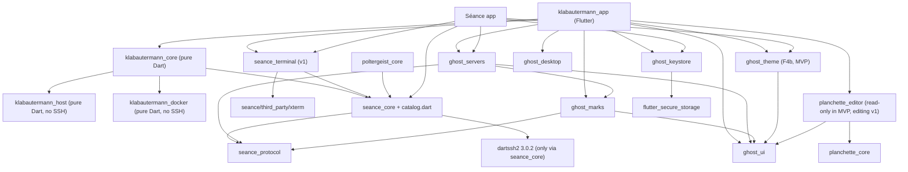

# 03. Architecture

Status: plan with owner decisions of 2026-10-10. Nothing here is implemented.

The decision log (section 2) was synthesized from three competing proposals,
A (agentless-first minimalist), B (capability-first with an optional
companion) and C (suite-integration-first), judged by an engineering review
and a product and security review. "A's", "B's" and "C's" in rejected
alternatives refer to these proposals; the proposals are not kept.

The base is proposal A, which both reviews recommended. Grafted from C:
suite integration (`SshLink` in `seance_core`, product-neutral observation
packages, the elevation prelude, "move, switch, prove", the catalog home,
the keystore extraction, suite links, convergence tests). Grafted from B:
host tiers (the T1 design, the footprint manifest, durable detached-operation
results, the coverage card, the T2 prerequisites). Where this plan conflicts
with the feature catalog, it supersedes the catalog rows listed in
section 1.4. The owner's answers of 2026-10-10 to the proposal's open
questions are applied in place; each decision they changed carries an
"Owner decision 2026-10-10" sentence.

This chapter holds sections 1 to 11. Sections 12 to 15 (suite integration,
milestones, risks, owner decisions) and Appendices A to C continue with the
same numbering in [04-IMPLEMENTATION.md](04-IMPLEMENTATION.md); its Appendix
B maps every review "must address" item to the section that resolves it.
Milestones (M0 to M9) and spikes (S1 to S10) named here are scheduled in its
section 13; the extractions F1a to F7 are listed in 3.5.

Inputs: the feature catalog [02-FEATURES.md](02-FEATURES.md) (IDs such as
STK-06 refer to it), and the research reports r1 to r5 and codebase reports
c1 to c4, condensed in [01-RESEARCH.md](01-RESEARCH.md) and imported as
appendices under [research/](research/README.md). Short markers such as
"r5 §5.4" or "c1 §2.3" point to those reports:
[r1](research/r1-docker-managers.md) Docker managers,
[r2](research/r2-selfhost-platforms.md) self-host platforms,
[r3](research/r3-server-panels-monitoring.md) server panels and monitoring,
[r4](research/r4-native-mobile-clients.md) native and mobile clients,
[r5](research/r5-technical-feasibility.md) technical feasibility,
[c1](research/c1-catalog-sync.md) catalog and sync,
[c2](research/c2-ssh-exec-terminal.md) SSH, exec and terminal,
[c3](research/c3-shared-ui-app-shells.md) shared UI and app shells,
[c4](research/c4-suite-infra.md) suite infrastructure.

Name and identities (owner decision 2026-10-10, D38): the product is
Klabautermann, with display name `Klabautermann` and lowercase ASCII stem
`klabautermann` ([05-NAMES.md](05-NAMES.md#53-klabautermann)); the Windows
`CompanyName` is `ch.lkmc`, as for Séance and Planchette.

Markers: **[V]** verified in the repository at `bf1da58` when this plan was
written (path and line given); **[L]** verified by a local experiment when
this plan was written (Ubuntu 24.04 container with dash 0.5.12, bash 5.2.21
and sudo 1.9.15p5; Appendix A of 04); **[R]** taken from a research report
or a review without re-verification; **[U]** unverified, settled by the
named spike before the design relies on it; **[E]** estimate or design
value. Path abbreviations: `SC` = `seance/packages/seance_core/lib`, `SP` =
`seance/packages/seance_protocol/lib/src`, `PC` =
`poltergeist/packages/poltergeist_core/lib`, `PA` =
`poltergeist/app/poltergeist_app/lib`, `SA` = `seance/app/seance_app/lib`.

---

## 1. Summary and principles

### 1.1 Summary

1. **Product.** A native Flutter client for Linux, macOS, Windows, Android
   and iOS that monitors and manages servers and their Docker or Podman
   workloads over plain SSH, showing the same end-to-end encrypted server
   list as Séance and Poltergeist. It installs nothing on a host by default
   and opens no ports. Positioning (r2 §7): the control panel that is not
   installed on your server.
2. **Tiers.** T0 (agentless, while the app is open) delivers the MVP and v1.
   T1 (consented host timer files with a footprint manifest, no daemon, no
   port) is designed here and committed for v1.x, so alerts while closed and
   scheduled checks exist without a resident binary. T2 (an always-on
   companion written in Rust, an explicit opt-in per server) is planned as
   milestone M9 after v1.x, behind spike S10 and listed prerequisites.
3. **No dartssh2 in the product.** `seance_core` gains `SshLink`, a neutral
   connection handle (headless and streaming exec, stdin, signals, Unix and
   TCP byte streams, SFTP, a session-channel budget, dead-peer detection,
   bounded close). Every dartssh2 3.0.2 workaround lives there, and Séance
   gains dead-peer detection and classified channel errors.
4. **Packages.** `klabautermann_host` (sampler program, parsers, rate maths,
   cron, rules) and `klabautermann_docker` (HTTP/1.1, Engine API, compose
   labels) depend on no SSH package. `klabautermann_core` orchestrates I/O,
   operations and privilege over `SshLink`. The Flutter app sits on top.
5. **Server list.** A catalog and sync library,
   `package:seance_core/catalog.dart`, is extracted from Poltergeist's
   coordinator with Poltergeist switched first and byte-identical files. The
   MVP is a pull-only account member; writes arrive in v1 with the shared
   server editor, and with them publication of first-seen host-key pins,
   because Séance #56 is fixed in F3 before the MVP preview.
6. **Shared before copied.** Every extraction follows "move, switch, prove":
   a design doc, one existing app switched in the same PR, its full suite and
   pixel baselines unchanged. Only the extractions the MVP needs come before
   it (guards, `SshLink` and elevation, credential resolution, catalog with
   the Séance #56 fix, stores and keystore, `ghost_servers` part 1, and
   `ghost_theme` as F4b, so the preview ships theme editing); editor,
   terminal, links and palette land for v1.
7. **Transport.** One SSH connection per server per device; at most 8
   session channels (Poltergeist's headroom rule); Docker traffic on
   `direct-streamlocal` channels, which OpenSSH `MaxSessions` does not count;
   a custom HTTP/1.1 client; never a local listener for the Docker socket.
8. **Sampler.** HWS/1: the probe program and the session nonce go to the
   stdin of `sh -s`, every tick is one shell command line, a READY marker
   precedes the first tick, and every section is length-prefixed and
   nonce-framed. Verified on dash 0.5.12 and bash 5.2 to survive dash's pipe
   read-ahead [L].
9. **Privilege.** Per-server admin mode with C's elevation prelude: the
   builtin `read` takes one password line, `sudo -S -v` validates, and
   `sudo -n -- "$@"` runs as a sibling child of the same shell, followed by
   `exit $?`. Verified working, while A's `exec sudo -n` variant fails [L].
   Password sudo therefore also works for `crontab -`, privileged reads and
   `docker system dial-stdio`. From v1.x a per-server opt-in remembers the
   sudo password, and a second opt-in syncs it in a sealed sub-record
   (D41).
10. **Detached operations.** Long mutations run as transient units with
    `--collect` (or `setsid` without a usable manager), and a small inline
    wrapper writes the exit status and output to an operation directory on
    the host, so results survive unit unloading and phone suspension.
11. **Safety.** Observe-only by default, immutable operation plans whose
    preview is exactly what runs, re-validation before execution, no
    confirmation-free mutation, protected targets with typed confirmation,
    no `--remove-orphans` by default, other managers' stacks read-only, a
    device audit log from the MVP.
12. **Host writes are a tested contract.** Section 8.11 lists every file the
    app can create on a host; an integration test diffs the fixture host's
    filesystem before and after a scripted session.
13. **Sync records.** One new `RecordKind` with typed sub-records under a
    `klabautermann:` prefix, per-type budgets, sealed removal for every type,
    and no unbounded record class. Metrics, logs, inspect output and the audit
    log never sync.
14. **Engine isolate** from the first scaffold, with a plain-data protocol
    enforced by the generalized protocol guard.
15. **Delivery.** Spikes (M0), MVP-path foundations (F1 to F4 and F4b,
    about 23 to 33 engineer-weeks [E]), app milestones M1 to M4 to the MVP
    preview, shipped in suite releases labelled preview (about 44 to 60
    engineer-weeks from the start [E]), then F5 and M5 to M7 to v1 (about 27
    to 38 more [E]), then T1 and the v1.x differentiators (M8), then the
    Rust companion (M9, XL, estimated after spike S10).

### 1.2 Principles

1. **Zero footprint by default.** T0 writes to a host only what section 8.11
   lists, each item caused by an explicit user action or a documented
   by-product of one.
2. **No listening ports.** None on the host (NG-17) and none on the device
   for the Docker socket (r5 §1.3). Device port forwards (NET-11, v1) bind
   loopback only, open on demand and close with their view.
3. **SSH is the only transport.** No third-party endpoint by default;
   anything that contacts a registry, forge, notification service or LLM is
   opt-in and labelled (+E in the catalog).
4. **Observe first.** New servers start read-only (SAF-01); management needs
   a per-server switch and root needs admin mode (SAF-02).
5. **Host files are the truth.** Compose files, `.env`, crontabs, units and
   T1 state are re-read on open and never mirrored into a shadow database
   (r2 §6.4). Uninstalling the app leaves every workload running.
6. **Honest coverage.** Unknown is drawn as unknown, never as zero; charts
   draw gaps; every alert surface says which tier evaluated it and what it
   cannot catch.
7. **Shared before copied.** Root `AGENTS.md:5` [V]. No third copy of any
   shared implementation; native runner code is the only ledgered exception
   (D32). The Rust companion (M9) is a second implementation of collectors,
   parsers and rules in another language, approved by the owner and held to
   the Dart one by shared fixtures and parity tests (D31).
8. **Respect other owners.** Stacks and containers managed by another tool,
   by Swarm or by a systemd unit are badged and read-only by default.
9. **No silent wire changes.** The sync "never touch" list (c1 §4.3) holds:
   no crypto, envelope, LWW, blob layout or `kProtocolVersion` change
   (`SP/version.dart:4`, value 1 [V]); no new `ServerConfig` fields.
10. **Preserve identities.** Application IDs, keychain entry names,
    settings keys, file shapes and `deviceId`s of Séance and Poltergeist are
    preserved byte for byte by every extraction.

### 1.3 Release scope at a glance

| Release | Contents | Execution | Sync |
|---|---|---|---|
| MVP (preview, in suite releases labelled preview from M4) | Catalog §2: fleet list, overview, processes, services, journal and file tails, scheduled jobs, containers, images, logs, stats, compose stacks; single-target guarded actions; access check; settings; themes through `ghost_theme` with theme editing and presets | T0 | Pull-only |
| v1 (first public) | Catalog §4 table stakes; in-app server editing; container exec; config edits with diff, backup and validation; volumes, networks, prune; packages read-only; hardware; triage; in-app alerts with local notifications; session history; hand-offs to Séance and Poltergeist (X-03, X-04, X-10) | T0 | Read-write, own record kind (`pref` and `rule` types); first-seen host-key pins published |
| v1.x | T1 host checks and notifier, scheduled update checks, host recorders and "Enable sysstat", desktop tray, Android watch mode, remembered and optionally synced sudo password, volume browsing with a confirmed helper container, tier B hosts, update pipeline, drift detection, log explorer, fleet tables | T0 and T1 | Adds query, layout, window, sudo and registry types; `rule` gains `evalScope: host` |
| Later | M9 after v1.x: the Rust T2 companion (opt-in per server) and the Later rows tagged T2 except ALR-12, ALR-13 and X-09, which wait on further decisions (9.4). Not estimated: backups inside the app on T1, permissive template catalogs, push relay (further decision), Séance metrics strip | T1; T2 on servers where the user enables it | Companion records bounded and decided in M9 (9.4) |

### 1.4 Deviations from and corrections to `02-FEATURES.md`

| Item | Catalog says | This plan | Reason |
|---|---|---|---|
| SAF-11 | v1 | MVP | The MVP already mutates; the log is small and builds trust |
| SAF-02 data source | `sudo -S -p '' -v && sudo -n -- <cmd>` in one shell | Elevation prelude with no `exec` and a trailing `exit $?` | bash execs the last command of `-c` implicitly, which breaks the PPID-keyed credential cache [L] (8.3) |
| SAF-08 note | `sudo -S` cannot feed a password to `dial-stdio` | It can, through the prelude | The builtin `read` consumes exactly one line and leaves the rest of stdin to the command [L] |
| SAF-23 | `systemd-run --collect`, followed with `journalctl -u` | Transient unit plus a host status record and log file; runner chosen per host | Collected units lose `Result`; users without journal access cannot follow root units (D25) |
| SAF-12, X-05 backups | Backup next to the file | Central backup directories | A `.bak` file in a directory read by glob (for example `sites-enabled/*`) is loaded by the service (D27) |
| CN-03 | Nonce-framed sections | Also length-prefixed; nonce delivered on stdin, never in argv | Other local users can read argv; length prefixes defeat forged markers even if a nonce leaks (D22) |
| CN-22 | Classified `SSHChannelOpenError` | Classified by channel type plus open count | sshd refuses a session channel with `SSH2_OPEN_CONNECT_FAILED` "open failed", not "resource shortage" [R: openssh-portable `serverloop.c`, reported by review] |
| §2 prerequisites | `ghost_prompts` and `ghost_theme` before the MVP | Prompts inside `ghost_servers` part 1; `ghost_theme` before the MVP as F4b, as listed | D8; D9 (owner decision 2026-10-10) |
| ALR-11, §6 | Inbox for agent alerts | Command inbox shipped in suite 1.9.0 (`seance/CHANGELOG.md:86,111` [V]); Séance's inbox cursor stops at unknown-app items (`SC/src/inbox/inbox_service.dart:216-221` [V]) and must change first | D31 |

---

## 2. Decision log

This log resolves every open design question once. Later sections elaborate
it and do not reopen it. When a section conflicts with the log, the log
wins; changing a decision means editing this section in the same PR, as
Poltergeist does (`poltergeist/docs/plan/00-OVERVIEW.md:56-59` [V]). The
owner's decisions of 2026-10-10 (04, section 15) are recorded in the
entries they touch; rejected alternatives stay for the record.

Quick index: D1 tiers · D2 scope · D3 move, switch, prove · D4 no dartssh2
in the product · D5 product packages · D6 catalog home · D7 stores and
keystore · D8 `ghost_servers` part 1 · D9 theme · D10 charts and logs ·
D11 terminal · D12 suite links · D13 enrollment · D14 pull-only MVP · D15
host keys · D16 endpoint pins · D17 record kinds · D18 engine isolate · D19
connection budget · D20 Docker transport · D21 API negotiation · D22
sampler · D23 dartssh2 pin · D24 elevation · D25 detached operations · D26
operation plans · D27 host write contract · D28 audit · D29 history and
alerts · D30 T1 · D31 T2 · D32 native runner code · D33 UI composition ·
D34 mobile · D35 localization · D36 integration fixtures · D37 CI · D38
identities · D39 assistant · D40 multi-device · D41 remembered sudo
password

### Shape and scope

- **D1. Agentless first, with designed host tiers.** T0 delivers the MVP and v1.
  T1 is designed in 9.3 and committed for v1.x, because alerts while closed and
  scheduled update checks are part of the owner's "and so on" and phones cannot
  poll in the background (iOS about 30 s at system-chosen times; Android
  WorkManager every 15 min at most; `dataSync` services limited to 6 h per 24 h
  [R: r5 §5.4]). T2 is planned for M9 after v1.x (D31). Owner decision
  2026-10-10: T2 is planned as a milestone instead of "Later, behind an owner
  decision". *Rejected:* B's companion inside the committed plan (a resident
  root-equivalent binary, its packaging and signing on the MVP path, and a
  changed release graph); A's "no T1 design unless the owner asks" (leaves the
  largest product gap without a plan).
- **D2. The catalog tiers are the scope.** MVP, v1, v1.x and Later follow
  `02-FEATURES.md` §2 to §4 with the deviations in 1.4. Any further
  deviation needs an entry here. *Rejected:* re-cutting scope per architecture.

### Code sharing

- **D3. Move, switch, prove.** Every extraction (1) starts with a design doc
  in `docs/design/` in the format of `server-appearance-package.md` (scope,
  inventory with `path:line`, public API, strings, staged PRs), approved by
  the owner, including canonical wording where copies differ; (2) moves the
  code and switches at least one shipped app in the same PR, with compat
  `export` shims where call sites are many; (3) runs that app's full suite
  and pixel baselines unchanged. Behaviour changes, including divergence
  resolutions, ride in separate PRs with their own tests and changelog
  lines. Same-PR bookkeeping: release-tool owned pubspecs, CI lines,
  `scripts/test.sh`, localization allowlist entries that go dead,
  `poltergeist/docs/PORTS.md` ledger entries, a Séance pin-audit record when
  `seance/` lineage changes. The rule applies to the extractions the next
  milestone needs, not to every candidate. Cut line: narrow an extraction
  that stalls (move fewer pieces, switch one app), never copy. *Rejected:*
  app-local copies with ledgers (root `AGENTS.md:5`); C's full foundation
  train before the scaffold (puts the v1 extractions F5a and F5c to F5f,
  about 9 to 16 engineer-weeks [E], ahead of the scaffold).
- **D4. No dartssh2 in the product.** `SshLink`, `RemoteProcess`, `ByteDuplex`,
  the channel budget and classification, ping timeout, bounded close and
  late-open cleanup live in `SC/src/ssh/`. `SshSession.runCommand`
  (`SC/src/ssh/ssh_session.dart:488` [V]) delegates to the same exec core. A
  generalized root import guard enforces that no file under `klabautermann/`
  imports or declares dartssh2; its first PR reproduces Poltergeist's current
  verdicts exactly and encodes the existing exceptions (D4 rules in 3.4).
  *Rejected:* A's `klabautermann_core/lib/src/connection/` and B's
  `klabautermann_remote` (a third confinement zone; Séance gains nothing).
- **D5. Four product packages.** `klabautermann_host` and `klabautermann_docker`
  (pure Dart, no SSH, no `seance_*`), `klabautermann_core` (pure Dart
  orchestration over `SshLink`), `klabautermann_app` (Flutter). RemoteGit's
  injected runner (`SC/src/ssh/remote_git.dart`) is the precedent. *Rejected:*
  A's single core (a T1 generator or Séance's metrics strip would force a
  later extraction); B's core shared with a companion (couples the MVP
  to T2 packaging).
- **D6. Catalog library inside `seance_core`.** A secondary library,
  `package:seance_core/catalog.dart`, holds `RecordCoordinator` with
  per-prefix handlers, the persistent record store, the server store,
  enrollment, the catalog writer and `EndpointPinStore`. Poltergeist
  migrates first with byte-identical files and `deviceId`s; the new app
  uses it from its first commit; Séance migrates after v1 (F7) but adopts
  the quarantine handler for pulled pins in F3 (#56, D15). The owner
  approved the recommended resolution of each of the five divergences
  between today's two implementations (c1 §3.3) on 2026-10-10; each lands
  as its own PR after the behaviour-preserving move (4.4). *Rejected:* a new
  `seance_catalog` package (one more owned package, and both Poltergeist
  gates hard-code `{'seance_core', 'seance_protocol'}`:
  `poltergeist/tool/license_gate/lib/license_gate.dart:33`,
  `poltergeist/tool/seance_pin_audit/lib/seance_pin_audit.dart:24` [V]);
  reusing Poltergeist's coordinator (requires a bookmark store and drags
  transfer, archive and ffi dependencies [R: c1 §2.1]); a pull-only applier
  in the app (a third copy of the tombstone, shield and freshness rules).
- **D7. Stores and keystore are extracted.** `ghost_keystore`
  (`MasterKeyManager` parameterized by entry prefix, with the
  `hasExistingVault` contract and its tests) and the pure `FileVaultStore`,
  `VaultRekeyJournal` and `FileHostKeyStore` (into `SC/src/store/`) move
  with Poltergeist switched in the same PRs and Séance in follow-ups.
  `CredentialResolver` moves into `seance_core` with both apps switched.
  *Rejected:* A's "thin app adapter" (a third copy of logic whose
  `hasExistingVault` argument is load-bearing: minting a key over an
  existing vault destroys it, `seance/AGENTS.md` §7 [V]).
- **D8. Prompts, dots and connection views in `ghost_servers` part 1.**
  Neutral view models for the host-key, keyboard-interactive and credential
  prompts and for the connection log and test report, with one adapter per
  app; the status-dot vocabulary; the server sectioning rules (Séance's
  Flutter-free `server_grouping.dart`). Dependencies: `ghost_ui`,
  `ghost_marks`, `seance_protocol` only. *Rejected:* a separate
  `ghost_prompts` (always used with a server); moving `HostKeyDecision`,
  `SshConnectionLog` and `ConnectionTestResult` into `seance_protocol`
  (shared verbatim with the sync server, `seance/AGENTS.md` "Repository
  layout" [V]).
- **D9. `ghost_theme` before the MVP (F4b); theme editing in the preview.**
  `ghost_theme` is extracted from both apps' theme stacks with Séance
  switched (Poltergeist follow-up) as F4b, after or in parallel with F4 and
  preferably before M1, at the latest before M4. The app builds its light
  and dark themes through it from the scaffold on, installs the extensions
  shared widgets need (`SidebarThemeTokens`, `FamilyPalette`, menu theme)
  and ships theme editing and presets in the MVP preview; pasting a theme
  from a sibling app is v1 (X-01). Owner decision 2026-10-10: theme editing
  ships in the MVP preview; the proposal had a fixed brand preset in the
  MVP and `ghost_theme` in v1. The cost is an L-sized extraction against
  Séance's real-font PNG baselines on the MVP path. *Rejected:* a fixed
  brand preset in the MVP with `ghost_theme` in v1 (the earlier proposal);
  a third port of the theme stack.
- **D10. Charts and the log viewer start in the app.** Both are new code with
  host-neutral APIs (string bags, theme tokens, no app types) under
  `lib/ui/charts/` and `lib/ui/logs/`, moved to `ghost_ui` or a `ghost_logs`
  package when a second consumer appears (Séance metrics strip X-07, the shared
  connection log view). No chart package resolves in any lockfile today
  [R: c3 §5.1]. Local notifications for v1 alerts use
  `flutter_local_notifications` (BSD-3). Owner decision 2026-10-10: charts stay
  in-house (confirmed) and the notification plugin is approved. *Rejected:*
  `fl_chart` (not needed for sparklines and a 1 to 4 series chart); shared
  packages with no second consumer (speculative layering, root `AGENTS.md` "Code
  design").
- **D11. Terminal.** Container shells (CTX-07, v1) use `XtermTerminalEngine`
  moved into `seance/packages/seance_terminal` (Flutter, outside the
  pure-Dart workspace, Séance switched). Host shells hand off to Séance.
  *Rejected:* a `ghost_terminal` package in `planchette/packages`
  (`SA/services/xterm_engine.dart:5` imports `seance_core` [V], and shared
  ghost packages must not, `docs/design/server-appearance-package.md:64,85`
  [V]); an embedded host terminal (r4 §4.3).
- **D12. Suite links for the v1 hand-offs.** `suite_links` in `seance_core`
  builds and strictly parses `seance://`, `poltergeist://` and
  `klabautermann://`. Séance gains link intake with a trust review and no
  command parameters: today its Android manifest has only the launcher intent
  filter (`seance/app/seance_app/android/app/src/main/AndroidManifest.xml:39-42`
  [V]) and no Apple URL types exist [V]. Poltergeist gains Android and iOS
  registration (macOS `Info.plist:13-20`, the Linux desktop entry and the
  Windows runner already exist [V]). Both land in v1 (F5d): Séance's intake
  opens a known server and asks before connecting, and a link can only pick a
  server and a starting folder, never run a command. Until both land, the app
  does not offer hand-offs on that platform. Owner decision 2026-10-10:
  hand-offs in v1, and the starting-folder parameter is accepted, so X-10 moves
  from v1.x to v1. *Rejected:* promising X-03 and X-04 without intake (the links
  would fail).

### Server list and sync

- **D13. The shared list comes only through shared-account enrollment.** The app
  logs into the user's Séance account like Poltergeist's shared mode; the user
  asserts Séance >= v0.9.0 on every device
  (`PA/services/sync_account_gate.dart:19` [V]). Desktop local-only mode imports
  `~/.ssh/config` into a device-local store. *Rejected:* a separate
  Klabautermann account (cannot see `serverConfig` records); reading another
  app's files (impossible on mobile, bypasses LWW on desktop).
- **D14. Pull-only MVP.** The catalog runs with `pushPolicy: none`: it pulls
  and applies `serverConfig`, `secret:` and `hostkey:` records through the
  shared handlers and never seals a dirty record; a test proves it. Writes
  arrive in v1 with the shared editor and the record kind. Accepted by the
  owner on 2026-10-10. *Rejected:* MVP writes (fleet-corruption risk while
  the extraction matures).
- **D15. Host keys: quarantine; publication once Séance #56 is fixed.**
  `TofuVerifier` never auto-repins. Pulled pins go through the quarantine
  handler. Séance's missing conflict check for pulled pins (#56) is fixed in F3
  (F3d), before the MVP preview, by routing Séance's pulled `hostkey:` records
  through the same quarantine handler. Publication is enabled once that fix has
  shipped: the MVP is pull-only and publishes nothing, and from v1, when catalog
  writes arrive, Klabautermann publishes first-seen pins. Publication also
  requires the enrollment fleet assertion (FL-22) to cover the first Séance
  release with the #56 fix on every device; until the user asserts it,
  learned pins stay device-local. The `host:port` collision behind different
  jump routes stays a documented known limitation until a dedicated
  suite-wide task after v1, together with F7 (4.6). Owner
  decision 2026-10-10: fix #56 first, moved from F7 into F3; the proposal had
  kept publication off until #56 landed after v1, apart from an explicit "share
  this pin" action. *Rejected:* C's first-seen publication while #56 is open (a
  TOFU accepted on a hostile network would reach every Séance device, which
  applies pulled pins without a conflict check [R: c1 §2.3]).
- **D16. Endpoint pins in the catalog library.** `EndpointPinStore`
  (device-local) records the confirmed endpoint tuple per server. Background
  connections require a match; a mismatch pauses polling, asks the user and
  purges that server's caches. Séance and Poltergeist can adopt the same
  store. *Rejected:* an app-local store (Séance and Poltergeist would stay
  exposed to LWW endpoint rewrites).
- **D17. One product `RecordKind`, typed sub-records, sealed removal.** One enum
  value named after the stem; payload `{type, v, ...}`; ids
  `klabautermann:<type>:<id>`; per-type count and size caps; every
  `klabautermann:` type ignores unsealed tombstones and deletes with a sealed
  `removed` record; 1 MiB budget for the prefix (4.8). Confirmed by the owner on
  2026-10-10. *Rejected:* one kind per entity (every new entity touches
  `seance_protocol` and Séance's exhaustive switches again); unsealed tombstones
  (the server can forge them, c1 §4.1).

### Transport and collection

- **D18. Engine isolate from the first scaffold.** All SSH, sampling,
  parsing, Docker, sync and rule evaluation run in one engine isolate,
  following Poltergeist (`PA/services/engine_session.dart`). Requests and
  events are plain data with no function-typed fields, enforced by the
  protocol guard moved to root `tool/`. Spike S5 measures budgets; it does
  not decide placement. *Rejected:* A's spike-decided placement
  (retrofitting an isolate reshapes every API).
- **D19. One connection per host per device, 8 session channels.** The
  budget mirrors `PoolPolicy.maxChannelsPerTransport = 8`
  (`poltergeist/packages/poltergeist_core/lib/src/connection/pool_policy.dart`,
  defaults "frozen" by M0 measurements [V]); Docker streams use forwarding
  channels, which `MaxSessions` does not count [R: sshd_config(5)]. At most
  4 concurrent connection attempts with jitter. Poltergeist's pool stays
  untouched. *Rejected:* extracting `PooledConnectionManager` now (its
  defaults are bound to M0 evidence).
- **D20. Docker over streamlocal with an own HTTP/1.1 client.** Pure Dart
  over `ByteDuplex`: chunked bodies, NDJSON, stdcopy, `Upgrade: tcp`
  hijack. Fallback ladder in 5.9, including elevated `dial-stdio` through
  the prelude. Never a local TCP or Unix listener. *Rejected:* dartssh2's
  `SSHHttpClient` (TCP only, buffered, no upgrade [R: c2]); `dart:io`
  `HttpClient` (101 handling with `detachSocket` unverified [R: r5 §1.3]).
- **D21. Engine API negotiation.** Negotiated version = min(newest version
  in the recorded fixture corpus, server maximum); refuse below the server's
  `MinAPIVersion` or the client floor 1.41; models are written against a
  1.44 baseline with newer fields gated. Fixtures: 1.41, 1.44, 1.52, 1.55
  and Podman compat 1.44. *Rejected:* a fixed 1.44 pin (loses 1.52+ shapes);
  "always the server maximum" (untested shapes).
- **D22. HWS/1 sampler.** Section 6.2. *Rejected:* C's program-plus-`read`
  loop on one stdin (fails on dash, which reads ahead from pipes [L]); B's
  restart-on-change sampler with an argv nonce (channel churn; argv is
  readable by other local users).
- **D23. Stay on dartssh2 3.0.2.** Workarounds live in `SshLink` (5.10).
  The suite-wide re-pin to 4.x is a separate task because it touches M0
  evidence, pin audits and the `redactConnectionTrace` audit [R: c2 §3.3].
  Owner decision 2026-10-10: the re-pin starts now, in parallel, as its own
  PR across all apps with the full SSH test matrix, outside this plan's
  estimates; the `SshLink` workarounds shrink once it lands.

### Privilege and safety

- **D24. Admin mode with the elevation prelude.** Section 8.3. *Rejected:*
  A's `exec sudo -n` (fails: "a password is required" [L]); validating in
  one exec channel and running in another (the cache does not cross shells
  [L]); C's `2>/dev/null` on sudo (hides the rejection texts the app
  classifies). A remembered sudo password (v1.x, D41) only skips the
  prompt; admin mode still expires.
- **D25. Detached operations with a host status record.** Section 7.17.
  *Rejected:* relying on `systemd-run --collect` unit state (unloaded after
  completion, so the result is lost [R: systemd-run(1)]); `systemd-run
  --user` without linger (the user manager stops after the last session
  [R]); predictable `/tmp` paths (A).
- **D26. Operations are immutable plans; no confirmation-free mutation.**
  One `OperationPlan` produces the preview and the executed steps;
  re-validation before execution; restart and stop need at least a dialog
  naming the target, also from single-key bindings. *Rejected:* C's tier
  with no confirmation on desktop.
- **D27. Host writes are an enumerated, tested contract.** Section 8.11.
  Backups go to central app directories, never next to the edited file.
  Owner decision 2026-10-10: operation records and logs, central backups,
  the audit syslog line and the footprint manifest are accepted. "Enable
  sysstat" (HIS-03) may install sysstat and enable its timer after showing
  the exact commands and an explicit confirmation in admin mode. Helper
  containers for VOL-03 and CTR-21 are allowed as confirmed engine changes,
  removed afterwards; the proposal had listed them as never written,
  pending a decision.
- **D28. Audit log device-local plus a host syslog line.** Device JSONL from the
  MVP; `logger -t klabautermann` per mutation from v1 (default on, per-server
  toggle). Not synced: records are never garbage-collected server-side and
  Séance pulls the whole account every 5 minutes (`SA/app_state.dart:524` [V]).
  Confirmed by the owner on 2026-10-10.
- **D41. Remembered sudo password, optionally synced (v1.x).** A per-server
  opt-in "remember sudo password" stores it in the vault, behind the device
  keystore. A second per-server opt-in syncs it, only while the device's
  suite-wide "sync passwords" switch (`syncSecrets`, the existing
  credential-sync opt-in, SYN-02) is also on; a receiving device applies it only
  while its own switch is on. It travels as the sealed sub-record
  `klabautermann:sudo:<serverConfigId>` of the product record kind (D17, 4.8),
  never as a Séance `secret:` record, so Séance and Poltergeist never apply it
  (they skip the unknown kind or prefix, 4.8). Removal is a sealed `removed`
  record; unsealed tombstones are ignored. The switch subtitle and the threat
  model (8.12) disclose that anyone holding the account key, and every device on
  the account, obtains a password that grants root on that server. Admin mode
  still expires (8.2); a remembered password only skips the prompt. Owner
  decision 2026-10-10: optional and synced; the proposal had recommended
  device-local storage only. *Rejected:* a `secret:` record (Séance would adopt
  an unreferenced secret into its vault as an orphan, c1 §2.4); device-only
  storage (the earlier recommendation).

### Persistence, alerts and tiers

- **D29. Device-local history and in-app alerts in v1.** Session rings in
  the MVP; on-device rollups and in-app threshold alerts with hysteresis in
  v1, labelled "evaluated on this device while open", with local
  notifications through `flutter_local_notifications` (D10).
- **D30. T1 host checks in v1.x.** Consented POSIX scripts and timer pairs,
  user scope by default and system scope only in admin mode, a footprint
  manifest with checksums, one-action uninstall, a notifier with
  content-free payloads by default, and parity tests between the Dart rule
  evaluator and the scripts (9.3). Approved by the owner on 2026-10-10 with
  this scope.
- **D31. T2: an opt-in Rust companion, planned for M9 after v1.x.** The
  only acceptable shape is an inbox producer with no listener, no inbound
  control and no SSH or account keys, installed, updated and removed only
  by the client over SSH, never self-updating, running as a dedicated
  system user with hardening (9.4). Nothing is installed by default; the
  companion is an explicit opt-in per server. It is written in Rust. The
  SHA-256 hashes of its binaries are pinned in the client build of the same
  release through a release `needs:` edge; there is no signing key and no
  new CI secret. It cannot be built from `klabautermann_host` and
  `klabautermann_docker`, so collectors, parsers and rules exist twice
  (Dart in the app, Rust in the companion), and a shared fixture corpus
  with CI parity tests (same inputs, same parsed results and rule
  verdicts) is required. ServerBox's Rust parser crate `sbm_parser` is
  AGPL and is neither used nor copied [R: r4 §4.2]. The repository gains a
  Rust toolchain (rustup, cargo), static musl cross-builds for Linux x86_64
  and aarch64 (glibc builds if needed), cargo-deny or an equivalent licence
  and advisory check, and a companion release job. Spike S10 (Rust
  companion build and parity harness) precedes M9 (XL, estimated after
  S10). Prerequisites: Séance's inbox skips marked companion apps without
  stalling its cursor; companion keys are pinned on each device on first
  sight; records stay bounded. Owner decision 2026-10-10: T2 is planned
  (it was "only after an owner decision"), in Rust instead of the
  recommended Dart, with hash pinning instead of a signing key. *Rejected:*
  Dart AOT built from the product packages (the earlier recommendation:
  one implementation of collectors and rules, cross-compilation unproven
  with the pinned SDK); a release signing key (a new CI secret).

### Platform, UI and delivery

- **D32. Native runner code policy.** Settings-window runners, URL scheme
  registration and the Android keep-alive service (watch mode, D34) cannot be
  shared through Dart packages. They are copied with a ledger entry in
  `klabautermann/docs/SHARED.md` (source path and commit, divergences, owner)
  and reviewed for a shared plugin before a fourth copy appears.
- **D33. UI composition.** Poltergeist-style composition root with one
  controller per concern and narrow delegate seams; per-series
  `ValueListenable`s; desktop three panes, phone push navigation with
  bottom sheets (section 10).
- **D34. Mobile policy.** No background polling. On background: sampling
  stops at once, admin mode expires, the connection closes after a 30 s
  grace period unless a detached operation is being followed or Android
  watch mode is on. On return: reconnect and a "paused from ... to ..."
  banner. Android watch mode (PLT-11, v1.x) is a time-limited opt-in
  foreground service: off by default, started per session, stopped
  automatically with a notice saying so, within Android's limit of 6 h per
  24 h for `dataSync` services [R: r5 §5.4]. Owner decision 2026-10-10:
  approved for v1.x in this form.
- **D35. Localization and accessibility from day one.** ARB and
  `gen-l10n`; the localization contract scanner moves to root
  `tool/l10n_contract` with Poltergeist switched, instead of a second copy
  of its 2,803-line test
  (`poltergeist/app/poltergeist_app/test/localization_contract_test.dart`
  [V]).
- **D36. Integration fixtures.** An sshd plus `docker:dind` fixture built
  `FROM` Poltergeist's digest-pinned sshd base, with negative sshd variants.
  Live systemd and Podman stay on recorded fixtures and manual VM checks
  until proven in CI (11.3).
- **D37. CI policy.** The new client matrix builds on every PR like the
  siblings, with no path filter; the pure-Dart job runs on Ubuntu only; the
  integration job runs privileged `docker:dind`, pinned by digest with no
  ports beyond loopback, on ephemeral GitHub-hosted Linux runners, and other
  platforms use recorded fixtures; `package-linux.sh` becomes a shared root
  helper instead of a fourth copy. From M9 a companion job adds the Rust
  toolchain, the musl cross-builds, the licence and advisory check and the
  Dart and Rust parity tests (11.6). Owner decision 2026-10-10: every PR,
  accepting about 30 to 45 extra runner-minutes per PR and longer macOS
  queues; privileged DinD approved.
- **D38. Identities are fixed before M1.** Name `Klabautermann` (display)
  and `klabautermann` (ASCII stem), Android and Linux id
  `ch.lkmc.klabautermann`, Apple bundle id `ch.lkmc.klabautermannApp`,
  Windows `CompanyName` `ch.lkmc`, keystore prefix `klabautermann.` and the
  host artifact names are permanent once anything ships (04, section 12.3).
  Owner decision 2026-10-10: the name Klabautermann (the second alternate
  in 05) and `CompanyName` `ch.lkmc`, as for Séance and Planchette and
  matching the `ch.lkmc.*` ids, instead of the recommended `L-K-M`;
  Poltergeist stays the outlier.
- **D39. Assistant invariants.** No execution tools in chat
  (`seance/AGENTS.md` §8 [V]). Docker, systemd, cron and firewall danger
  rules go upstream into `DangerLinter` for the MVP (it has 14 rules,
  `SC/src/llm/danger_linter.dart:25-101` [V]: none for Docker, cron, `ufw` or
  `nft`; firewalls only through `iptables -F` (`:96-100`) and systemd only
  through the power-off rule (`:91-95`)). Chat features wait for
  `ChatController` to be parameterized upstream (v1.x).
- **D40. Multi-device behaviour.** Each device polls on its own; the
  monitor set is device-local; connects are capped and jittered; alerts may
  fire on more than one device (documented); edits use hash
  compare-and-swap; a host lock file (SAF-15, v1.x) is an inventory row.

---

## 3. Package layout and dependency boundaries

### 3.1 Tree

```
seance/packages/
  seance_protocol/       + one RecordKind value (v1); stays free of dart:io
  seance_core/
    lib/seance_core.dart     + exports: ssh_link, remote_process, byte_duplex,
                               channel_budget, elevation, credential_resolver,
                               push_batcher (batchForPush), sequential_cleanup,
                               suite_links (v1)
    lib/catalog.dart         NEW secondary library: catalog and sync layer
    lib/src/ssh/             + ssh_link.dart, remote_process.dart, byte_duplex.dart,
                               channel_budget.dart, elevation.dart,
                               credential_resolver.dart
    lib/src/catalog/         MOVED from PC/src/sync and PC/src/bookmarks, generalized
    lib/src/store/           MOVED FileVaultStore, VaultRekeyJournal, FileHostKeyStore
    lib/src/links/           NEW suite_links (v1)
    lib/src/llm/danger_linter.dart   + Docker, systemd, cron and firewall rules
  seance_terminal/       NEW Flutter package (v1): XtermTerminalEngine and views
planchette/packages/
  ghost_ui/              + IEC and rate formatters (MVP); GhostSplitter,
                           GhostColumnTable, GhostCommandPalette (v1)
  ghost_servers/         NEW: part 1 (MVP) dots, sectioning, prompts, connection
                           log and test report; part 2 (v1) server editor
  ghost_keystore/        NEW (MVP): MasterKeyManager; app lock added in v1
  ghost_theme/           NEW (MVP, F4b)
  ghost_marks/, ghost_desktop/, planchette_core/, planchette_editor/   unchanged
tool/                    root, run per product from one configuration file
  release_version/       + klabautermann registration
  import_guard/          MOVED from poltergeist/tool, generalized
  protocol_guard/        MOVED from poltergeist/tool, generalized
  license_gate/          MOVED from poltergeist/tool, generalized (marker kept)
  l10n_contract/         NEW, the scanner from Poltergeist's contract test
klabautermann/
  AGENTS.md CLAUDE.md README.md CHANGELOG.md LICENSE analysis_options.yaml .gitignore
  pubspec.yaml           _klabautermann_workspace: packages/klabautermann_host, klabautermann_docker, klabautermann_core
  packages/
    klabautermann_host/          pure Dart; dependencies meta, collection
    klabautermann_docker/        pure Dart; dependencies meta, collection; no dart:io in lib/
    klabautermann_core/          pure Dart; dependencies seance_core, klabautermann_host, klabautermann_docker
  app/klabautermann_app/         Flutter, not a workspace member; platform folders committed
  companion/             Rust crate (M9): collectors, parsers, rules, inbox producer
  test/integration/      sshd + docker:dind fixture (11.3)
  tool/capture_fixtures.dart
  scripts/               build.sh, release.sh (forwarder), package-linux.sh (thin
                         wrapper), build-flatpak.sh, test-macos-keyboard.{sh,mm}
  flatpak/ch.lkmc.klabautermann.yml
  media-sources/klabautermann-icon.png
  docs/plan/ (00-OVERVIEW decision log, 07-MILESTONES), docs/STATUS.md,
  docs/SHARED.md (native-runner ledger), docs/INSTALL.md
```

### 3.2 Dependency graph



`klabautermann_app` reaches `seance_core` types only through
`klabautermann_core`'s curated barrel with explicit `show` lists (precedent
`PC/poltergeist_core.dart:11-14` [R]). No ghost package depends on
`seance_core`. Poltergeist's and Séance's edges to the new shared packages
appear as each extraction switches them (3.5).

### 3.3 Package contents

| Package | Contents | Talks to the host through |
|---|---|---|
| `klabautermann_host` | HWS/1 program text and collector fragments; frame parser; one pure parser per collector (`ParseResult<T> parseX(String raw, ParseContext ctx)`, never throws); typed snapshots; counter-to-rate maths with wrap and reboot detection; cron parser and next-run evaluation in the server time zone; command builders with validators for `systemctl`, `journalctl`, `crontab`, `df`, `ss`, package tools; threshold rule evaluator with hysteresis; T1 script templates and health-file schema (v1.x) | Injected `CommandRunner` and `ShellChannel` interfaces (RemoteGit precedent, `SC/src/ssh/remote_git.dart`) |
| `klabautermann_docker` | HTTP/1.1 client; NDJSON, JSON-seq and JSON Lines scanner; stdcopy demultiplexer; versioned API client with negotiation and feature gates; tolerant models; event refresher logic; compose label model, project grouping, ownership markers, compose command builders and output parsers; image digest comparison | Injected `DuplexOpener` returning a `ByteDuplex` |
| `klabautermann_core` | Host engine: connections over `SshLink`, channel scheduling, sampler runner, followers, Docker endpoint discovery and transport selection, operation plans and runner, detached runner, admin-mode state machine over `seance_core` elevation, protected targets, masking rules, alert scheduling, history rollups and ring files, catalog adapters (monitor set, endpoint pins), audit writer, engine-isolate protocol | `SshLink` and the catalog library |
| `klabautermann_app` | Composition root, controllers, UI, ARB catalog, settings window, platform folders | `klabautermann_core` barrel only |

### 3.4 Machine-enforced rules

The guards that protect only `poltergeist/` today (c4 §1.5) move to root
`tool/` in F1 and run per product from one file. A sketch, including the
existing exceptions the first PR must encode:

```yaml
# tool/guards.yaml (sketch)
local_shared_trees: [seance/packages, planchette/packages]
products:
  poltergeist:
    scan: [packages, app]
    pure_packages: [packages/*]
    dartssh2_imports: [packages/poltergeist_core/lib/src/connection, packages/poltergeist_bench]
    dartssh2_dependents: [packages/poltergeist_core, packages/poltergeist_bench]
    seance_core_implementation_imports: [packages/poltergeist_core/lib/src/connection, packages/poltergeist_bench]
    engine_protocol: packages/poltergeist_core/lib/src/engine
    engine_protocol_callback_owners:
      packages/poltergeist_core/lib/src/engine/progress_coalescer.dart: [ProgressCoalescer]
      packages/poltergeist_core/lib/src/engine/connect_log_coalescer.dart: [ConnectLogCoalescer]
      packages/poltergeist_core/lib/src/engine/engine_probes.dart: [EngineProbes]
  seance:
    scan: [packages, app]
    pure_packages: [packages/seance_protocol, packages/seance_core, packages/seance_sync_server]
    dartssh2_imports: [packages/seance_core/lib/src/ssh, packages/seance_core/test]
    dartssh2_dependents: [packages/seance_core]
    dartssh2_dev_dependents: [app/seance_app]
    import_exemptions: [app/seance_app/test/host_key_blocked_test.dart]
    no_dart_io: [packages/seance_protocol/lib]
  planchette:
    scan: [packages, app]
    pure_packages: [packages/planchette_core]
    dartssh2_imports: []
    forbidden_dependencies: {"ghost_*": [seance_core]}
  klabautermann:
    scan: [packages, app]
    pure_packages: [packages/klabautermann_host, packages/klabautermann_docker, packages/klabautermann_core]
    dartssh2_imports: []
    forbidden_dependencies:
      klabautermann_host: ["seance_*", dartssh2, flutter]
      klabautermann_docker: ["seance_*", dartssh2, flutter]
    no_dart_io: [packages/klabautermann_host/lib, packages/klabautermann_docker/lib]
    engine_protocol: packages/klabautermann_core/lib/src/engine
```

1. dartssh2 is imported today in three `seance_core` library files
   (`SC/src/ssh/ssh_agent.dart`, `remote_file_system.dart`,
   `ssh_session.dart`), eight `seance_core` test files (for example
   `seance/packages/seance_core/test/ssh_proxy_jump_test.dart`,
   `ssh_keepalive_controls_test.dart`) and one Séance app test
   (`seance/app/seance_app/test/host_key_blocked_test.dart`) [V]. It is
   declared by `seance_core` (`pubspec.yaml:18`), `poltergeist_core`
   (`:24`), `poltergeist_bench` (`:14`) and as a dev dependency of the Séance
   app (`seance/app/seance_app/pubspec.yaml:85`) [V]. The generalized guard
   accepts exactly these and nothing under `klabautermann/`.
2. The first guard PR reproduces Poltergeist's current verdicts exactly
   (import guard `poltergeist/tool/import_guard/lib/import_guard.dart`, 220
   lines, constants at `:10-11,20` [V]), then adds the other products.
   Today's guard treats every directory under `packages/` as pure Dart
   (`:149-156` [V]); the generalized guard applies the purity rule only to
   `pure_packages`, because Planchette's `packages/` holds Flutter packages
   (`ghost_ui`, `ghost_marks`, `ghost_desktop`, `planchette_editor`) and
   Séance's gains `seance_terminal` (v1). The bench package's dartssh2
   imports (import guard `:199-201`) and the protocol guard's three callback
   owners (`poltergeist/tool/protocol_guard/lib/protocol_guard.dart:21-25`
   [V]) are existing exceptions.
3. `klabautermann_core` uses only the public `seance_core` barrel and
   `catalog.dart`; implementation imports (`package:seance_core/src/...`) are
   forbidden everywhere outside `seance/` except the exceptions listed in the
   guard file. Exporting the sequential-cleanup helpers removes one of
   `poltergeist_core`'s two `implementation_imports`
   (`connection/ssh_cleanup.dart:3` [V]). The other
   (`connection/ssh_transport.dart:10`, the SFTP adapter the barrel hides) and
   the bench package's four (`poltergeist_bench/lib/ssh_driver.dart:7-8` and two
   `test/dependency_contracts` files) [V] stay as encoded exceptions.
   `batchForPush` is exported for the catalog library's push batching (4.4,
   divergence 3), not to remove an existing import.
4. Engine request and event types carry no function-typed fields
   (protocol guard, `poltergeist/tool/protocol_guard`).
5. Shared suite packages are local path dependencies, never git or hosted
   (generalized license and local-dependency gate; the
   `SEANCE_LICENSE_GATE_V1` release marker stays on Poltergeist's leg).
6. `seance_protocol` gains a `no_dart_io` rule: it is shared verbatim with
   the sync server and imports no `dart:io` today [V].

### 3.5 Prerequisite extractions

Each row follows D3. "Switched" names the shipped app moved onto the shared
code in the same PR. There is no F6. F5b moved to F4b (owner decision
2026-10-10, D9); the IEC formatters are part of F4.

| ID | Extraction | From | To | Switched | Needed by | Size [E] |
|---|---|---|---|---|---|---|
| F1a | Import guard, protocol guard, license and local-dependency gate, fixture-key scope list | `poltergeist/tool/*`, `poltergeist/test/integration/assert-private-keys-scoped.sh` | root `tool/`, root script | Poltergeist (identical verdicts) | M1 | M |
| F1b | Localization contract scanner | Poltergeist's `localization_contract_test.dart` (2,803 lines [V]) | root `tool/l10n_contract` with per-app allowlists | Poltergeist | M1 | S to M |
| F2a | `SshLink`, `RemoteProcess`, `ByteDuplex` (`openUnixStream`, `openTcpStream`), channel budget and classification, ping timeout, bounded close, late-open cleanup | new, around `SshSession.runCommand` (`SC/src/ssh/ssh_session.dart:488-586`, collapsed error at `:504` [V]) | `SC/src/ssh/` | Séance (`runCommand` and RemoteGit on the shared exec core) | M2 | M |
| F2b | Elevation (detection, prelude, classification, executor) | new | `SC/src/ssh/elevation.dart` | none (new capability; Séance adopts for snippets later) | M4 | S |
| F2c | `CredentialResolver` | `SA/services/app_services.dart:1075-1150`, `PA/services/server_editor_backend.dart:210-262` [R] | `seance_core` | Séance and Poltergeist | M1 | S |
| F2d | Docker, systemd, cron and firewall danger rules | new | `SC/src/llm/danger_linter.dart` | Séance benefits directly | M4 | S |
| F2e | Exports: `batchForPush`, sequential cleanup | `SC/src/sync/push_batcher.dart`, `SC/src/ssh/sequential_cleanup.dart` | `seance_core` barrel | Poltergeist (drops the `sequential_cleanup.dart` implementation import; the `remote_file_system.dart` import stays a listed exception) | M1 | S |
| F3a | Catalog library | `PC/src/sync/*`, `PC/src/bookmarks/bookmark_coordinator.dart` (1,543 lines [R]) | `package:seance_core/catalog.dart` | Poltergeist, byte-identical files | M1 | L |
| F3b | Pure stores | `SA/services/file_stores.dart`, `PA/services/file_stores.dart` (both pure Dart [R]) | `SC/src/store/` | Poltergeist (Séance follow-up) | M1 | S to M |
| F3c | `ghost_keystore` | `SA/services/secure_master_key.dart:75`, `PA/services/secure_master_key.dart:45` [V] | `planchette/packages/ghost_keystore` | Poltergeist (Séance follow-up); tests assert literal entry names | M1 | S to M |
| F3d | Séance #56: conflict check for pulled host-key pins (owner decision 2026-10-10, D15) | Séance's `hostkey:` apply path in `SC/src/sync/sync_coordinator.dart` | Séance's coordinator routes pulled pins through the catalog library's quarantine handler | Séance | M4 (before publication in v1) | S to M (1 to 2) |
| F4 | `ghost_servers` part 1; IEC byte and rate formatters | dot vocabulary (`SA/ui/server_status_dot.dart`, `PA/ui/server_state_indicator.dart`), sectioning (`SA/ui/server_grouping.dart`), TOFU, keyboard-interactive and credential dialogs, connection log view and test report [R: c3 §1.8]; Poltergeist's app-local rate formatter [R: c3 §5.4] | `planchette/packages/ghost_servers`; formatters in `ghost_ui` | Séance and Poltergeist (ARB adapters; dead allowlist entries removed); Poltergeist for the formatters | M1 to M2 | M |
| F4b | `ghost_theme` (owner decision 2026-10-10, D9) | both apps' theme stacks | `planchette/packages/ghost_theme` | Séance (Poltergeist follow-up) | M1 (after or parallel with F4; at the latest M4) | L |
| F5a | `ghost_servers` part 2: server editor and delegate | `PA/ui/server_editor.dart` (delegate seam) and Séance's copy | `ghost_servers` | Poltergeist (Séance follow-up with a delegate over `AppState`) | M5 (v1) | M to L |
| F5c | `seance_terminal` | `SA/services/xterm_engine.dart` and view widgets | `seance/packages/seance_terminal` | Séance | M5 | M |
| F5d | `suite_links`, Séance intake (a server and a starting folder only), Poltergeist mobile registration | `PA/services/seance_links.dart`, `PA/services/deep_links.dart` | `SC/src/links/` | Poltergeist (parser), Séance (intake) | M5 | M |
| F5e | Command palette, splitter, column table | Planchette palette, both splitters, `GhostFileColumnHeader` | `ghost_ui` | Planchette, Séance and Poltergeist respectively | M6 | M |
| F5f | App lock | `SA/services/app_lock.dart` [V] | `ghost_keystore` | Séance | M6 | S |
| F7 | Séance on the catalog library | `SC/src/sync/sync_coordinator.dart` | catalog library | Séance | after v1 | L |

### 3.6 Additions to `seance_core` and why they live there

| Addition | Why `seance_core` |
|---|---|
| `SshLink` and the exec core | One dartssh2 confinement zone for the suite; Séance gets dead-peer detection, which it lacks today (no ping timeout anywhere in its path, c2 R3), plus channel classification and exit signals |
| `ByteDuplex` streams | The only safe place to apply the listen-before-write workaround once |
| Elevation | Pure command wrapping and classification usable by Séance snippets and inbox proposals that need root |
| `CredentialResolver` | Two near-identical app copies exist today |
| Danger rules | Séance snippet runs and inbox reviews benefit |
| Catalog library and stores | Two coordinator implementations already diverge (c1 §3.3); a third must not appear |
| `suite_links` | Poltergeist already builds `seance://` links app-side; a strict shared parser serves every intake |
| `ChatController` parameters (v1.x) | The system prompt and tool set are Séance constants today [R: c2 §6] |

Not in `seance_core`: sampler and parsers (`klabautermann_host`, so Séance does
not compile a product it does not ship, and Séance can still path-depend on it
for X-07); Docker client (`klabautermann_docker`); Poltergeist's pool (frozen by
M0 evidence, D19); `TcpBannerProber` stays where it is, because moving it into
`seance_protocol` would add the first `dart:io` socket code to a package shared
with the sync server; the Rust companion (M9) implements its own probe.

---

## 4. Server catalog and identity

### 4.1 Requirement

There is no shared local server list: each app keeps its own
`servers.json`, vault, host-key file and keystore entries, and mobile
sandboxes rule out cross-app file access (c1 §0, §2.1). The only way to show
the same list is the E2E sync account in shared-account mode: Séance's
`serverConfig` records with bare UUID ids, which Poltergeist already reads
and writes after logging into the user's Séance account.

### 4.2 Account modes

| Mode | What the user gets | Notes |
|---|---|---|
| Shared account (default) | The Séance list, groups, marks and colours | Same account and passphrase as Séance; enrollment in 4.3 |
| Local only (FL-02) | Hosts imported from `~/.ssh/config` | Desktop only; uses `seance_core`'s ssh_config importer; device-local, never pushed in the MVP; from v1 the user may publish selected entries as new `serverConfig` records, deduplicated by host, port and user |
| No account | Empty list with an explanation | Phones without an account see nothing, and the first-run card says why |

A separate Klabautermann-only account (Poltergeist's "Design B") is not offered:
it cannot see `serverConfig` records. `DELETE /v1/account` is never exposed,
because it deletes every app's data (SYN-07).

### 4.3 First-run enrollment and batch onboarding (FL-22)

One flow, built for phones with many servers:

1. **Explain and log in.** The list comes from the Séance sync account; log
   in with the same server URL, account and passphrase. Enrollment uses the
   shared `SyncEnrollment` (prelogin, KDF-downgrade refusal, login, trial
   decrypt) and re-keys the local vault to the passphrase-derived key with
   the re-key journal.
2. **Fleet assertion and disclosures.** The user confirms that every device
   runs Séance v0.9.0 or later (pre-0.9.0 builds decode unknown kinds as
   server configs, c1 §2.4); the sheet discloses that the account key
   decrypts every app's records and that the MVP publishes nothing, and,
   from v1, asks the user to confirm that every device runs a Séance
   release with the #56 fix (F3d) before first-seen pins are published
   (D15).
3. **Batch endpoint confirmation (SAF-09).** A list of servers with host,
   port, user and jump route; "confirm all shown", per-row toggles and
   search. Unconfirmed servers stay visible with reachability only.
4. **Monitor set (FL-21).** Pick servers for fleet metrics; defaults to
   none on phones and to confirmed servers with non-interactive credentials
   on desktops, capped at 10 [E].
5. **Observe-only notice (SAF-01).** Every server starts read-only;
   management is a per-server switch.

### 4.4 The catalog library

Contents, moved rather than rewritten (F3a): `SyncTuple` (from
`BookmarkSyncTuple`), `PersistentLocalRecordStore`, `FileServerConfigStore`,
the read-only catalog snapshot, `SyncEnrollment`, the host-key mutation gate
and verdict stores, and a `RecordCoordinator` generalized from
`BookmarkCoordinator.runRound` and its prefix dispatch, plus `CatalogWriter`
and `EndpointPinStore`.

```dart
abstract interface class RecordHandler {
  /// First id segment before ':'; null handles bare ids (serverConfig).
  String? get prefix;
  ApplyPhase get phase; // configs, then pins, then secrets last
  Future<ApplyOutcome> applyLive(EncryptedRecord record, ApplyContext c);
  Future<ApplyOutcome> applyTombstone(EncryptedRecord record, ApplyContext c);
}

enum PushPolicy { none, normal } // none: never seal a dirty record (MVP)
```

Behaviours kept from Poltergeist's implementation: an apply cursor that never
advances past a deferred record; dispatch by plaintext prefix before decrypting;
unknown prefixes skipped undecrypted; `hostkey:`, `secret:` and `snippet:`
tombstones never honoured; payload id equals envelope id on apply; the tripwire
store. Built-in handlers: `ServerConfigHandler`, `HostKeyHandler` (quarantine,
negative pins, kept verdicts), `SecretHandler` (shield, strictly-newer freshness
floor, device switch). Poltergeist registers a `BookmarkHandler`; Klabautermann
registers one handler for its prefix from v1.

**Divergences.** The owner approved the recommended resolution of each of
the five differences c1 §3.3 found (2026-10-10); the design doc records
them, and each resolution is its own PR after the behaviour-preserving
move:

| # | Divergence | Approved resolution | Effect |
|---|---|---|---|
| 1 | Séance withholds pins for addresses used only by excluded servers; Poltergeist does not | Adopt Séance's rule in `HostKeyHandler` | Poltergeist gains the privacy rule |
| 2 | Poltergeist's `onHostKeyPinned` has no call site (`bookmark_coordinator.dart:474` [V]) | The writer supports deliberate publication; Klabautermann publishes first-seen pins from v1, after the #56 fix in F3d (D15); Poltergeist keeps its current behaviour | No behaviour change in the move |
| 3 | Poltergeist pushes every dirty record in one request | Batch with `batchForPush` against advertised limits (1000 records, 8 MiB, 1 MiB blob, `SP/sync/dtos.dart:102-108` [V]) | Latent 413 fixed in Poltergeist |
| 4 | Séance pulls everything every round; Poltergeist pulls deltas | Deltas with full-resync fallback | Séance unchanged until F7 |
| 5 | Séance quarantines the whole file on corruption; Poltergeist keeps undecodable rows verbatim | Keep Poltergeist's behaviour | Séance unchanged until F7 |

**Migration order.** Poltergeist first, with `servers.json`
(`{version, servers, syncTuples}`), `sync_records.json`, settings keys and
`deviceId` byte-identical (golden files), its core sync suites and the
`sync_integration` CI job green, and `poltergeist_sync` still building.
Klabautermann from its first commit. Séance last (F7, after v1), with a
migration from its JSON list and `deleted_records.json`, `deviceId`
preserved. Séance #56 is resolved earlier: in F3d its current coordinator
routes pulled `hostkey:` records through the library's quarantine handler
before the MVP preview (owner decision 2026-10-10, D15).

**Pull-only mode (MVP).** `PushPolicy.none` disables sealing, catalog
writes, pin publication and secret publication. Host pins learned on this
device stay local. A test runs a full round against a fake server and
asserts that no record is ever marked dirty and no push request is sent.

**Write semantics (v1).** The shared writer reproduces the rules both apps
already follow (c1 §2.1): re-stamp `updatedAt = max(now, stored + 1)`, seal
with this install's `deviceId`, clear a pending tombstone on save, persist a
delete tombstone before dropping the row, retract an orphaned `secret:`
unless another non-excluded server shares it, and require a strictly later
`updatedAt` for exclusion toggles. The shared editor copies unknown and
unshown fields from the stored config (the `jumpHostId` and
`startDirectory` loss Poltergeist hit, `poltergeist/docs/PORTS.md:1108-1120`
[R]). No new `ServerConfig` fields: older builds drop unknown fields on
re-push (c1 §2.4).

### 4.5 Credentials

- **Vault and keystore.** Own `vault.json` with the re-key journal; own
  keystore entry `klabautermann.vault.masterKey.v1` and sync token
  `klabautermann.apikey.sync.token` (pattern of `seance.vault.masterKey.v1` and
  `poltergeist.vault.masterKey.v1` [V]), loaded through `ghost_keystore`'s
  `hasExistingVault`-aware path. macOS uses the legacy login keychain
  (`MacOsOptions(usesDataProtectionKeychain: false)`), like both siblings.
- **Synced secrets.** Applied only when the device `syncSecrets` switch is
  on, the server has `syncSecret: true`, it is not excluded, and the record
  passes the freshness floor (c1 §2.2). Otherwise the app prompts and stores
  the credential locally under the same `secretRef` (SYN-02).
- **Resolution.** `CredentialResolver` (vault lookup by `secretRef`,
  identity file through an injected reader, agent through `SshAgentClient`).
  On mobile, agent auth and `identityFilePath` generally do not work, so the
  prompt offers to import a key into the vault.
- **Background rule (FL-21).** Background sampling uses only servers whose
  credentials resolve without a prompt and whose endpoint is confirmed;
  keyboard-interactive servers connect on explicit open only and get exactly
  one connection (Poltergeist growth rule 2 [R]).
- **sudo password (D41).** Engine-isolate memory for the admin window only in
  the MVP and v1. From v1.x a per-server opt-in "remember sudo password" stores
  it in `vault.json`, behind the device keystore, and the engine loads it when
  admin mode starts. A second per-server opt-in syncs it as the sealed
  sub-record `klabautermann:sudo:<serverConfigId>` (4.8), only while the
  device's `syncSecrets` switch ("sync passwords", SYN-02) is on; a receiving
  device applies it only while its own switch is on and the server is not
  excluded. It is never a `secret:` record, because Séance would adopt an
  unreferenced secret into its vault as an orphan (c1 §2.4); Séance and
  Poltergeist skip the sub-record and never apply it (4.8). Turning sync off
  publishes a sealed `removed` record, which drops the synced copies on other
  devices (unsealed tombstones are ignored); turning "remember" off also deletes
  the local copy. The switch subtitle says that anyone holding the account key,
  and every device on the account, obtains a password that grants root on that
  server (8.12).

### 4.6 Host keys

- Verification through `TofuVerifier` (`SC/src/hostkey/tofu.dart`), which
  never auto-repins, with the pin locator `ServerConfig.host` verbatim plus
  port so pins match across apps.
- Pulled `hostkey:` records go through the quarantine handler: installed only
  without conflict, conflicts parked behind a diff, negative pins and kept
  verdicts honoured.
- Publication (D15): Séance #56 is fixed in F3d, before the MVP preview.
  The MVP is pull-only and publishes nothing; from v1, when catalog writes
  arrive, first-seen pins are published once the user confirms that every
  device runs a Séance release with the fix. Publication waits for that
  assertion (4.3), because older Séance releases apply pulled pins
  unchecked.
- Known limitation: pins are keyed by `host:port`, so identical private
  addresses behind different jump routes collide (c2 R8). The app warns
  when two servers in the list share a locator with different routes. The
  fix changes the suite's pin locator convention and is a dedicated
  suite-wide task after v1, together with F7 (owner decision 2026-10-10).

### 4.7 Endpoint confirmation (SAF-09)

Any device can rewrite a server's host through LWW, and a background poller
would then hand a credential to the new host (c1 §4.1). `EndpointPinStore`
records `{serverId: host, port, username, jump route ids, confirmedAt}` per
device. Background connections (fleet sampling, probes, Docker events)
require a matching pin; a synced change to any element stops polling for
that server, purges its device caches (SYN-08) and asks again. The store is
in the catalog library so Séance (which probes every configured server) and
Poltergeist (which gates probing on a local connect,
`PA/services/probe_settings_store.dart` [V]) can adopt it.

### 4.8 Synced record kinds (v1 onward)

Protocol constraints: no envelope, crypto, LWW, blob layout or
`kProtocolVersion` change; kinds travel inside the sealed payload and the
server is kind-agnostic (c1 §1.2); kinds match by name, never index
(`SP/records/record.dart:13-21` [V]).

- **One kind.** One `RecordKind` value named after the stem, added to the enum
  at `SP/records/record.dart:22-32` [V]. The same PR updates Séance's apply
  switch (`SC/src/sync/sync_coordinator.dart:666-855`, which must `continue`)
  and `RefusedRecord` description (`SC/src/sync/sync_engine.dart:41-48`) [V].
  Deployed Séance >= v0.9.0 decodes an unknown kind name as `unknown` and skips
  it (`sync_coordinator.dart:854-855` [V]); Poltergeist skips unknown prefixes
  undecrypted (c1 §2.4). The enum value and switch updates therefore ship no
  later than the release in which Klabautermann first writes the kind; no
  earlier release is needed, and an unknown-kind skip test against the previous
  release's Séance and Poltergeist builds proves it (11.2).
- **Ids.** `klabautermann:<type>:<id>`. Dispatch splits at the first colon, so
  the stem must not equal an existing prefix (`hostkey`, `secret`, `snippet`,
  `bookmark`, `assistant`, `inboxapp`, `inboxstatus`, c1 §1.1). Never a bare id
  (Séance treats a colon-free tombstone as a server delete). No host names,
  paths or query text in ids: they are plaintext on the server.
- **Removal.** Every `klabautermann:` type ignores unsealed tombstones; deletion
  is a sealed record `{type, v, id, removed: true}` (inbox-app precedent). A
  forged tombstone can therefore neither silence a rule nor drop a user-marked
  protected target.

| Type | Id | Sealed content | Blob cap [E] | Count cap [E] | Release |
|---|---|---|---|---|---|
| `pref` | `klabautermann:pref:<serverConfigId>` | read-only flag, cadence preset, pinned units and containers, user-marked protected targets, panel order; tags (FL-13, v1.x) | 8 KiB | one per server | v1 |
| `rule` | `klabautermann:rule:<uuid>` | alert rule: metric, scope, comparison, raise and clear thresholds and durations, severity, `evalScope` (`device`; `host` from v1.x) | 4 KiB | 200 | v1 |
| `query` | `klabautermann:query:<uuid>` | saved log query: name, source kind, filters, optional scope | 4 KiB | 200 | v1.x |
| `layout` | `klabautermann:layout:<uuid>` | overview card and fleet column layout, scope | 8 KiB | 20 | v1.x |
| `window` | `klabautermann:window:<uuid>` | maintenance window: scope, schedule, time zone | 2 KiB | 100 | v1.x |
| `sudo` | `klabautermann:sudo:<serverConfigId>` | remembered sudo password for that server, only behind both opt-ins of D41 | 1 KiB | one per server | v1.x |
| `registry` | `klabautermann:registry:<uuid>` | registry host, user and secret for `X-Registry-Auth` (REG-02), behind an opt-in | 2 KiB | 50 | v1.x |

Rules for every type: payload id equals envelope id on apply; per-server
records are neither published nor applied for `excludeFromSync` servers and
are retracted (sealed `removed`) when a server becomes excluded; "server
absent: pending" is distinct from "server removed"; unknown `type` values
are kept verbatim and skipped; writes are batched with `batchForPush`.
Account budget for the prefix: at most 1 MiB in total, warn at 80 %, shown
in the account size view (SYN-09). There is no record class whose count
grows with time or events (no per-incident acknowledgements, no audit
entries).

### 4.9 What never syncs

Metrics, history, logs, inspect output, `docker compose config` output,
snapshots, the audit log, endpoint pins, the monitor set, Docker endpoint
and binary path overrides, capability caches, admin-mode state, the sudo
password unless both opt-ins of D41 are on, T1 manifests (the host copy is
the truth) and templates (SYN-03, SYN-08).

### 4.10 Device-local files

All under the app's `getApplicationSupportDirectory()` (location fixed by the
platform identities in 04, section 12.3):

| File | Content | Owner | Release |
|---|---|---|---|
| `servers.json`, `sync_records.json` | Catalog mirror and materialized list | catalog library | MVP |
| `vault.json`, `vault.json.rekey` | Credentials and re-key journal | `SC/src/store/` | MVP |
| `host_keys.json`, verdict and tripwire files | Pins and quarantine state | catalog library | MVP |
| `endpoint_pins.json` | Confirmed endpoints | catalog library | MVP |
| `settings.json` | Device settings, `klabautermann.sync.deviceId` (minted once, never regenerated), monitor set, per-server device preferences | app | MVP |
| `capabilities/<serverId>.json` | Cached probe results, 24 h TTL | `klabautermann_core` | MVP |
| `audit/<serverId>.jsonl` | Audit log, 90-day retention [E] | `klabautermann_core` | MVP |
| `history/<serverId>/<tier>.ring` | Fixed-size binary rollups (`RandomAccessFile`, no rewrite per sample) | `klabautermann_core` | v1 |
| `alerts.jsonl` | In-app alert history, 30 days [E] | `klabautermann_core` | v1 |

Configuration stays in JSON files like both siblings (`seance/AGENTS.md` §9
[V]); the rollup ring is binary because it is append-heavy. Logs, inspect
output and snapshots touch disk only through explicit export. Per-server
caches are purged and polling stops on remote delete, exclusion or endpoint
change (SYN-08).

---

## 5. Transport and connection management

### 5.1 `SshLink` (F2a)

```dart
abstract interface class SshLink {
  ServerConfig get config;
  Stream<SshLinkState> get states;   // connecting, ready, degraded, lost, closed
  SshLinkLimits get seen;            // learned session limit, forwarding refused, ...
  Future<RemoteCommandResult> run(String command,
      {Duration timeout, int maxOutputBytes, List<int>? stdin});
  Future<RemoteProcess> start(String command, {PtyRequest? pty});
  Future<ByteDuplex> openUnixStream(String socketPath);
  Future<ByteDuplex> openTcpStream(String host, int port); // v1, NET-11
  Future<RemoteFileSystem> openFileSystem();
  Future<void> close();              // bounded; never hangs
}

abstract interface class RemoteProcess {
  Stream<List<int>> get stdout;      // subscribed at creation, bounded, pausable
  Stream<List<int>> get stderr;      // always drained
  StreamSink<List<int>> get stdin;   // close() sends channel EOF
  Future<RemoteExit> get exit;       // exit code or exit signal
  void signal(RemoteSignal signal);  // fire-and-forget
  Future<void> close();              // TERM, close, bounded wait
}
```

- Built on `openAuthenticatedClient` (`SC/src/ssh/ssh_session.dart:694`
  [V]) with `keepAliveInterval: null`, as its documentation asks when a pool
  owns liveness (`:692-693` [V]); TOFU, keyboard-interactive and jump-host
  seams (16 hops, cycle detection [R: c2 §2.1]) are reused unchanged.
- **Liveness (CN-06).** Idle ping every 15 s; a ping not answered within
  30 s marks the link lost and closes it (Poltergeist's pattern [R: c2
  §2.5]). dartssh2 3.0.2's own keepalive never times out (c2 R3).
- **Reconnect (CN-05).** Backoff with 1 s base, 30 s cap and downward jitter
  (Poltergeist's constants [R]); journal cursors and Docker `since=` resume.
  Background reconnects never prompt; a server that needs a prompt waits
  for the user.
- **States** cross the isolate boundary as plain data: `idle`,
  `connecting`, `authenticating`, `ready(capabilities)`, `degraded(reason)`,
  `backoff(until)`, `needsUser(prompt)`, `closed(reason)`.
- **Mobile.** On background, sampling stops at once and the link closes
  after a 30 s grace period unless a detached operation is being followed.
- `SshSession.runCommand` is re-implemented on the same exec core, so
  Séance's RemoteGit and command flows gain classification and exit signals
  with no other behaviour change; Séance adopting dead-peer detection for
  its terminal sessions is a separate PR with its own changelog line.

### 5.2 Channel budget (CN-01, CN-22)

OpenSSH `MaxSessions` (default 10) counts shell, exec and subsystem sessions
per connection, not forwarding channels [R: sshd_config(5)].

| Consumer | Session channels | Lifetime |
|---|---|---|
| Fast sampler (`sh -s`) | 1 | While any view of the host is visible |
| Slow sampler (`sh -s`) | 1 | Same; idles between requests |
| Followers (`journalctl -f`, `tail -F`, operation log follow) | up to 2 | While their view is open |
| Short actions and one-shot reads (`SshLink.run`) | up to 2, queued | Per call |
| SFTP | 1 | Opened lazily, closed after 60 s idle |
| Compose CLI, `dial-stdio`, elevated exec | 1 | Per operation |
| **Cap** | **8** | Mirrors `PoolPolicy.maxChannelsPerTransport` [V] |

- A semaphore in `SshLink` enforces the cap; waiters show "waiting for a
  free channel" with the reason. Priority when tight: sampler, then
  user-initiated actions, then follows, then SFTP.
- Docker API calls use forwarding channels and cost no session slot: one
  pooled keep-alive duplex for short calls and one duplex per stream, capped
  at 16 per host [E] to protect the daemon and the 2 MiB window per channel.
- **Low-session mode.** sshd refuses a session channel above `MaxSessions`
  with `SSH2_OPEN_CONNECT_FAILED` and the text "open failed", not with
  "resource shortage" [R: openssh-portable `serverloop.c` and `session.c`,
  as read by review; re-confirmed in spike S1]. The link therefore classifies
  by channel type plus open count: a session-type open refused with
  connect-failed while fewer than 8 sessions are open sets the learned limit
  to the current count, and the engine degrades (one follower, polled stats,
  stack logs merged through one `docker compose logs -f`, the mode named in
  the server header).
- Interactive-auth servers get exactly one connection, never a second
  transport. A second connection is opened only for non-interactive auth
  and only when long-lived work exhausts the budget.

### 5.3 Failure classification

| Symptom | Classification | UI |
|---|---|---|
| Session-type channel refused, connect-failed "open failed", sessions open below the cap | Host `MaxSessions` below the budget | Low-session mode, named in the header |
| Streamlocal open refused (OpenSSH answers every streamlocal refusal with `SSH2_OPEN_CONNECT_FAILED` "open failed", whatever the cause [R: openssh-portable `serverloop.c` `server_input_channel_open`, reported by review]) | One exec probe per path: `test -S p` failing means a missing socket, `test -w p` failing means `EACCES`, both passing means forwarding is disabled (`AllowStreamLocalForwarding no` or `remote`, `DisableForwarding yes`, or an `authorized_keys` `restrict` or `no-port-forwarding` option [R: r5 §1.1]) | Missing: next candidate path; `EACCES`: the access check entry with fix options; disabled: switch to the CLI relay and explain the sshd setting (confirmed with `sshd -T -C` in admin mode) |
| Handshake fails against chacha20-only or ML-KEM-only servers; Android KEX timeout | dartssh2 3.0.2 client limitation (c2 R12, R13) | "This server requires an algorithm Klabautermann does not support yet" (CN-23) |
| Exit 127 or "command not found" | Tool missing | Panel hidden with the reason |
| `nologin` shell or `ForceCommand` | Restricted account | Read-only reachability; explanation |
| Link ping timeout | Dead peer | Backoff; stale values turn grey |

### 5.4 Docker Engine API over the forwarded socket

- `SshLink.openUnixStream(path)` opens OpenSSH `direct-streamlocal@openssh.com`
  through dartssh2's `forwardLocalUnix` (present in 3.0.2 [R: c2 §3.2]; no
  call exists in the repository today [V]). sshd opens the socket as the
  authenticated user, so normal permissions apply.
- **Listen before write.** `SSHForwardChannel.stream` is a lazy `map` in
  3.0.2, so data that arrives before the first listener can stall the
  channel for good (c2 R2; fixed upstream in 4.0.1). The wrapper subscribes
  at once into its own bounded buffer (4 MiB [E]) and pauses the SSH
  subscription when its consumer pauses, which keeps backpressure end to
  end.
- **Endpoint discovery (CN-07)**, once per session after the probe: a
  per-server override (device-local), `/var/run/docker.sock`,
  `/run/user/<uid>/docker.sock`, `/run/podman/podman.sock`,
  `/run/user/<uid>/podman/podman.sock`. `<uid>` and socket presence come from
  the probe. Several engines may coexist; the user picks a default per
  server.
- The socket is never exposed on a local TCP port or local Unix socket: it
  is root-equivalent (r5 §1.3).

### 5.5 HTTP/1.1 client (`klabautermann_docker`)

- Pure Dart over `ByteDuplex`, about 600 to 900 lines [E]: request writer
  (method, versioned path, `Host: docker`, `Content-Length` bodies); status
  and header parser; `Content-Length`, chunked (with trailers) and
  connection-close bodies; robust to every chunk boundary (tests split input
  at every byte).
- Body modes: `buffered(maxBytes)`, `bytes`, `lines` (NDJSON,
  `application/json-seq`, `application/jsonl`), `jsonValues` (concatenated
  objects), `hijack` (after `101 UPGRADED` or `200` on exec start or attach,
  the raw duplex goes to the caller).
- Connection reuse: requests on the pooled duplex are serialized (no
  pipelining); `Connection: close` retires it. Per-request timeouts for
  short calls; cancellation closes the duplex.
- Errors: 400 (version), 404 (object gone, refresh), 409 (conflict, show the
  daemon message), 500 map to typed failures.

### 5.6 Streams

| Stream | Endpoint | Framing | Cancel | Resume |
|---|---|---|---|---|
| Container logs | `GET /containers/{id}/logs?follow=1&tail=N&timestamps=1&stdout=1&stderr=1` | stdcopy 8-byte frames unless `Config.Tty` (from inspect; Docker sets `Content-Type: application/vnd.docker.multiplexed-stream` or `application/vnd.docker.raw-stream` from API 1.42; from 1.42 the header is used when present and cross-checked with `Config.Tty`; below 1.42 a current daemon labels every logs response raw-stream, and older daemons and possibly Podman's compat layer omit it [R: moby `container_routes.go` `getContainersLogs`, reported by review]); split on `\n` after demultiplexing | Close the duplex | `since=<unix seconds>.<9-digit nanoseconds>` converted from the last delivered line's RFC3339Nano timestamp (the API rejects RFC3339 with 400); `since` is inclusive, so drop re-sent lines up to and including the last delivered one [R: moby `getContainersLogs`, `loggerutils/logfile.go`, reported by review] |
| Stats, list | `GET /containers/{id}/stats?stream=false&one-shot=true` | One JSON object | n/a | Deltas between polls client-side (one-shot `precpu_stats` not meaningful [U]) |
| Stats, detail | `GET /containers/{id}/stats?stream=1` | JSON lines | Close | n/a |
| Events | `GET /events?since=&filters=` | JSON lines; `Type`, `Action`, `Actor` only (1.52 removed the legacy fields), legacy shape accepted below 1.52 | Close | `since=` last event time; full re-list after a gap over 60 s |
| Pull progress | `POST /images/create?fromImage=&tag=` | JSON values keyed by layer `id`; `progressDetail`, `errorDetail` | Close (the daemon finishes the pull) | n/a |

Every stream feeds a bounded ring (lines and bytes, a line-length cap); when
the consumer falls behind, the subscription pauses and the view shows
"dropped N lines" (c2 R17).

### 5.7 Exec and attach upgrade (v1, CTX-07)

1. `POST /containers/{id}/exec` with `AttachStdin/Stdout/Stderr`, `Tty`,
   `ConsoleSize [rows, cols]`, `Cmd`, optional `User` and `WorkingDir`.
2. `POST /exec/{id}/start` with `Connection: Upgrade` and `Upgrade: tcp`; on
   `101` or `200` the hijacked duplex becomes a `SessionTransport` for the
   shared terminal engine (raw bytes with `Tty`, stdcopy otherwise).
3. Resize with `POST /exec/{id}/resize?h=<rows>&w=<cols>` on the pooled
   duplex. `TerminalSize` is columns first while Docker and the local PTY API
   are rows first; every boundary has a test (c2 R15; Séance's PTY test
   precedent, `seance/AGENTS.md` §4 [V]).
4. Stdin EOF is a channel half-close; `GET /exec/{id}/json` reads the exit
   code after the stream ends.
5. Attach (CTX-09, v1.x) uses the same path and never sends the detach keys
   (Ctrl-P Ctrl-Q) by accident.

### 5.8 Version negotiation (CN-08, D21)

- `HEAD /_ping` (fallback `GET`) gives `Api-Version` and, on Podman,
  `Libpod-API-Version`; `GET /version` gives `ApiVersion` and
  `MinAPIVersion`. All paths are versioned (`/v1.xx/...`).
- `negotiated = min(clientMaxTested, serverMax)`, where `clientMaxTested` is
  the newest version in the recorded fixture corpus (1.55 today; the moby
  master spec is 1.56 [R: r5 §1.4]). Refuse with a clear message when the
  result is below the server's `MinAPIVersion` or below the client floor
  1.41. Docker 29.0 to 29.2 rejected clients below 1.44; 29.3 lowered the
  floor to 1.40; Podman's compat layer reports max 1.44, min 1.24 [R: r5
  §1.4].
- Models target 1.44. Feature gates from the negotiated version: event shape
  (1.52), `/system/df` shape (1.52, 1.53), `/images/json` `Containers` count
  (1.51), attestations (1.55). Models ignore unknown fields.

### 5.9 Transport ladder and fallbacks

| Rank | Route | When | Session cost | Header label |
|---|---|---|---|---|
| 1 | Streamlocal to the engine socket | Forwarding allowed, socket writable | 0 | "Engine API via SSH socket forward" |
| 2 | `docker system dial-stdio` (or `podman system dial-stdio`) over `SshLink.start` | Forwarding refused or socket unreachable, CLI can reach the daemon | 1 per HTTP connection; low-session mode | "via docker CLI relay (limited streams)" |
| 3 | Elevated relay: `sudo -n docker system dial-stdio` with NOPASSWD, or the elevation prelude in front of it with the password line first and HTTP bytes after (8.3) | User cannot reach the socket; admin mode on | Same | "via sudo relay (root-equivalent)" |
| 4 | `socat STDIO UNIX-CONNECT:<path>` or `nc -U` | No CLI, relay present (rare [U]) | Same | "via socat relay" |
| none | | Nothing works | | Docker panels hidden with the exact reason and the CN-24 access check |

TCP 2375 and 2376 are never offered. A Dropbear host older than 2024.84
has no Unix stream forwarding and uses rank 2; 2024.84 to 2025.88 get a
CVE-2025-14282 warning [R: r5 §1.1].

### 5.10 dartssh2 3.0.2 defects and mitigations (D23)

| Defect (c2) | Mitigation | Where |
|---|---|---|
| Data before the first listener stalls a forward channel (R2) | Subscribe at creation, bounded buffer, pause propagation | `ByteDuplex` |
| Keepalive pings never time out (R3) | Own idle ping with a 30 s timeout | `SshLink` |
| A refused `env` request closes the channel (R9) | Never send `env` requests; prefix variables in the command | exec core |
| `SSHClient.close()` can hang (R14) | Bounded close; late channel opens closed after their timeout | `SshLink` |
| Unread stderr buffers without limit (R17) | Always drain both streams | `RemoteProcess` |
| One window adjust per data packet (R2) | Accepted; measured in S1 for 1,000 lines/s follows | n/a |
| No chacha20-poly1305, no ML-KEM; SHA-1 KEX and CBC still proposed; Android KEX isolate timeouts (R12, R13) | Classified as client limitations (CN-23); suite re-pin to 4.x as its own task | connect classification |
| Rows and columns order (R15) | Boundary tests | `seance_terminal`, exec |

### 5.11 Other streams

- **Port access (NET-11, DKE-09, v1).** `openTcpStream(host, port)` feeds an
  in-app web view without a loopback listener where spike S7 shows that
  works [U]; otherwise a random `127.0.0.1` port on explicit action, closed
  with its view. Needs `AllowTcpForwarding` (default yes).
- **Privileged files (SAF-12, v1).** SFTP runs as the login user. Root-owned
  files use the elevation prelude in front of commands (`cat`, temp file plus
  `tee` in the same directory, `chown --reference`, `chmod --reference`,
  `restorecon` when SELinux enforces, hash re-check, `mv`), or an elevated
  `sftp-server` on an exec channel if spike S6 proves it [U].

### 5.12 Connection etiquette

One long-lived connection per host per device keeps login records and
`MaxStartups` pressure low (r5 §3.2). Fleet connects are capped at 4
concurrent with jitter; reachability probes reuse `ProbeService`
(`SC/src/probe/probe_service.dart:64`, 45 s jittered sweeps, at most 6
concurrent [V]) and run only for confirmed endpoints.

---

## 6. Host data collection

### 6.1 Capability probe (CN-02, CN-24)

The first request on the slow sampler after connect returns a `HostProfile`,
cached for the session and on the device for 24 h so panels render before
the probe returns:

| Section | Source |
|---|---|
| Kernel, architecture | `uname -s -r -m` |
| Distribution | `/etc/os-release` (`ID`, `ID_LIKE`, `VERSION_ID`, `PRETTY_NAME`) |
| Init and systemd | `/proc/1/comm`, `/run/systemd/system`, `systemctl --version` first line |
| Virtualization | `systemd-detect-virt`, `systemd-detect-virt -c` (SYS-04) |
| Identity | `id -u`, `id -un`, `id -nG` (journal and docker groups) |
| Elevation | `sudo -V` first line (sudo or sudo-rs), `sudo -n true` result, `command -v doas run0`, `command -V printf` (builtin or not, 8.3) |
| Tools | `command -v` for about 30 tools: `journalctl`, `crontab`, `ss`, `ip`, `lsblk`, `findmnt`, `smartctl`, `sensors`, `docker`, `podman`, `socat`, `timeout`, `setsid`, `ncdu`, `gdu`, `sadf`, `logger`, `systemd-run`, `apt-get`, `dnf`, `dnf5`, `apk`, `pacman`, `zypper`, `nvidia-smi`, ... |
| Kernel features | `/proc/pressure/cpu` readable; `/sys/fs/cgroup/cgroup.controllers` (cgroup v2) |
| Locale | `locale -a` contains `C.UTF-8` |
| Engine sockets | `test -S` and `test -w` per candidate path (5.4) |
| Session | `$SSH_CONNECTION`, the sshd parent of the session (protected targets) |
| Clock | `date +%s`, `date +%z`, `timedatectl show -p Timezone` or `/etc/timezone` |
| Detached-operation support | `loginctl show-user "$(id -un)" -p Linger`, logind `KillUserProcesses` [U: readable unprivileged], `XDG_RUNTIME_DIR` |

Each panel declares the capabilities it needs; a panel that cannot work is
hidden with its reason and, where one exists, a copyable fix command that
the app never runs implicitly (Cockpit degradation, r3 §6.9). Unknown is
shown as unknown, never as zero.

### 6.2 Sampler protocol HWS/1 (CN-03, D22)

- **Start.** A non-PTY exec of
  `exec env LC_ALL=C TZ=UTC SYSTEMD_PAGER= NO_COLOR=1 sh -s`. The login shell
  (sh, bash, zsh, fish, tcsh) only parses this constant line; SSH `env`
  requests are never used. The sampler shell runs under `LC_ALL=C` so that
  `${#var}` counts bytes; collectors that need UTF-8 rendering prefix
  `LC_ALL=C.UTF-8` on their own command when the probe found that locale
  (A11Y-08).
- **Program.** The client writes the program (function definitions only) to
  stdin. Its first line sets the per-session 128-bit random nonce, so the nonce
  never appears in argv, where other local users could read it through `ps` or
  `/proc/<pid>/cmdline`. The program is a constant assembled in
  `klabautermann_host` from collector fragments and contains no user-supplied
  text. It ends by printing a READY marker. The client sends nothing else until
  it has read READY.
- **Requests.** Each request is one shell command line:
  `hw_t <seq> <collector>...` for a tick, `hw_o <seq> <collector> <arg>...`
  for an on-demand read (for example one unit's `systemctl show`). Collector
  names come from a fixed enum (`^[a-z][a-z0-9_]*$`); arguments pass a
  type-specific validator and then `quoteShellWord`
  (`SC/src/terminal/shell_command.dart:63`, safe for sh, bash, zsh and fish
  [V]). Nothing else is ever written to the sampler's stdin. At most one
  request is outstanding per sampler; a tick that would overlap is skipped
  and counted.
- **Why command lines.** dash, the `/bin/sh` of Debian and Ubuntu, reads
  ahead from a pipe: a `read` loop inside a program sent on the same stdin
  loses request lines that arrive in the same write, while command lines are
  simply parsed in order [L] (04, Appendix A, E1 and E2). Collectors run with
  stdin from `/dev/null`, so none can consume the request stream.
- **Replies.** Framed by the nonce and length-prefixed:
  `\036<nonce> B <seq> <uptime>`, then per collector
  `\036<nonce> S <collector> <status> <bytes>`, a newline, exactly
  `<bytes>` bytes of payload and a newline, then `\036<nonce> E <seq>`.
  `<status>` is `ok`, `missing` (tool absent), `denied`, `timeout` or
  `error`; collectors capture their stderr in the payload so the UI can say
  why a value is missing. The parser reads exactly `<bytes>` bytes and then
  expects a marker; any mismatch is a framing error that resynchronizes on
  the next `E` marker. A forged marker inside a payload is consumed as
  payload, so forgery fails even if a nonce leaks. Control characters other
  than newline and tab are stripped before display.
- **Fork budget.** Builtin collectors append to a shell variable while
  reading `/proc` and `/sys` with `read`, so the fast path forks nothing.
  Collectors that run an external program capture it with command
  substitution; that subshell fork accompanies an exec the collector needs
  anyway. Spike S2 measures CPU per tick against the 11.4 budget.
- **Two samplers.** The fast sampler runs only builtin collectors over
  `/proc` and `/sys` counters that cannot block. The slow sampler runs
  forking and potentially blocking tools (`df` on a stale NFS mount,
  `systemctl`, `docker compose version`, the process list, whose
  `/proc/<pid>/cmdline` reads can block on a stuck process) under
  `timeout 10` when available. A hung slow collector cannot stall CPU
  graphs.
- **Timeouts.** A request without its `E` marker within its deadline
  (fast 5 s, slow 30 s [E]) makes the client send `TERM` (OpenSSH 7.9 and
  later signal the process group [R: r5 §1.2]), close the channel and
  restart the sampler with backoff. A missed tick is visible on the client
  as a gap, not as a stale value.

### 6.3 Program sketch

Verified on dash 0.5.12 and bash 5.2.21 with the program and two ticks in
one write, including a correct byte count for a UTF-8 payload [L]
(04, Appendix A, E7):

```sh
# Written once to the sampler's stdin; the client substitutes the nonce.
N=0123456789abcdef0123456789abcdef
NL='
'
hw_sec() { printf '\036%s S %s %s %s\n%s\n' "$N" "$1" "$2" "${#3}" "$3"; }
c_load() { st=ok; o=''; read -r o </proc/loadavg || st=error; }
c_cpu() {
  st=ok; o=''
  while IFS= read -r l; do
    case $l in cpu*) o="$o$l$NL" ;; *) break ;; esac
  done </proc/stat
}
c_df() {
  if ! command -v df >/dev/null 2>&1; then st=missing; o=''; return 0; fi
  o=$(timeout 10 df -PT -B1 </dev/null 2>&1)
  case $? in 0) st=ok ;; 124) st=timeout ;; *) st=error ;; esac
}
hw_t() {
  s=$1; shift
  read -r up _ </proc/uptime
  printf '\036%s B %s %s\n' "$N" "$s" "$up"
  for c in "$@"; do st=error; o=''; c_$c </dev/null; hw_sec "$c" "$st" "$o"; done
  printf '\036%s E %s\n' "$N" "$s"
}
printf '\036%s READY HWS/1\n' "$N"
```

The production program adds `timeout` absence handling (BusyBox and
Alpine), `denied` detection, the collectors in 6.4 and a protocol version
check. The program text is versioned (`HWS/1` plus a collector-set version)
and is the single source for every runner, including the T1 scripts (9.3).

### 6.4 Collectors and cadence

| Collector | Sampler | Source | Desktop | Phone | Cellular saver |
|---|---|---|---|---|---|
| `overview` (fleet rows) | fast | `cpu` lines of `/proc/stat`, filtered `/proc/meminfo`, `/proc/loadavg`, `/proc/net/dev` | 5 s | 10 s | 30 s |
| `core` (focused server) | fast | the above plus per-core lines, `/proc/diskstats`, `/proc/pressure/*`, `/proc/uptime`, `btime` | 2 s | 3 s | 10 s |
| `fs` | slow | `df -PT -B1`, `df -Pi` under `timeout 10` | 30 s | 60 s | 120 s |
| `procs` | slow | `/proc/<pid>/stat`, `status`, `cmdline` with builtins; `ps -eo ...` or BusyBox `ps w` fallback | 3 s while visible | 5 s while visible | 10 s |
| `units` | slow | `systemctl list-units --all --output=json` (systemd 246+), else `--plain --no-legend`; `systemctl --failed` | 15 s while visible; 60 s for the health card | same | same |
| `timers`, `cron` | slow | `systemctl list-timers --all --output=json`; `crontab -l`; `/etc/crontab`; `/etc/cron.d/*`; `cron.{hourly,...}` | 60 s while visible | same | on demand |
| `identity` | slow | `/etc/os-release`, `uname`, `hostnamectl --json=short` (systemd 249+) | once per session | same | same |
| `temps`, `gpu`, `smart` (v1) | slow | hwmon and thermal sysfs, `nvidia-smi --query-gpu=...`, `smartctl -n standby -j` | 10 s, 30 s, 10 min | same | on demand |
| `packages` (v1) | slow | `apt-get -s upgrade`, `dnf check-update`, ... (7.8) | on demand, 60 min | on demand | on demand |
| Docker summary | n/a | `/events` driven | event-driven | event-driven | event-driven |

Everything pauses when its view is hidden or the app is backgrounded; the
polling budget (SAF-19, v1) caps per-server cadence. Rates are computed
client-side from counter deltas with wrap detection and reset detection (a
changed `btime` or a decreasing counter starts a new series); disk
throughput uses 512-byte sectors (CN-04). A filtered core sample is about
1.5 to 2.5 KB and an overview sample about 600 B [R: r5 §3.3].

### 6.5 Parsing and fixtures

- One pure parser per collector in `klabautermann_host`, tolerant of truncation,
  extra fields (`diskstats` field counts vary by kernel), wrapped `df` lines
  and non-UTF-8 bytes; it returns a value plus warnings and never throws.
  Parsing runs in the engine isolate; UI code never parses.
- Fixtures: `klabautermann_host/test/fixtures/<platform-id>/<collector>.txt`
  with a JSON golden per fixture, captured by
  `klabautermann/tool/capture_fixtures.dart` (runs the real program once per
  collector) during spike S2 and refreshed from the fixture images. Raw captures
  are redacted and reviewed for host names before commit.
- Hostile-input tests: markers and the nonce inside process names, unit
  descriptions and log lines; embedded newlines and NULs; 64 KiB lines;
  wrapped `df` lines; Swarm task names (ServerBox #1226 [R]).
- The diagnostic bundle (CN-18, v1) exports the same raw format, redacted
  by `SecretRedactor`, so a user report becomes a fixture.

### 6.6 Portability matrix (CN-11 to CN-14)

| Host class | Tier | Metrics | Services | Logs | Jobs | Docker |
|---|---|---|---|---|---|---|
| Debian 12/13, Ubuntu 22.04 to 26.04, RHEL 9/10, Fedora, Arch (glibc, systemd >= 246) | A, MVP | full | JSON | journald JSON | cron and timers | full |
| RHEL/Alma/Rocky 8 (systemd 239 [U]), Ubuntu 20.04 (245 [U]) | A, MVP | full | text fallback (CN-10) | journald | cron and timers | full |
| LXC and containers | A, marked | `/proc` may be virtualized (lxcfs): affected values shown as "virtualized" (SYS-04) | as host | as host | as host | needs nesting |
| Alpine, BusyBox, OpenRC | B, v1.x | reduced (`ps w`, `df -k`, builtins) | `rc-status`, `rc-service` | `/var/log/messages` | `/etc/crontabs/<user>` | full if a socket exists |
| Non-systemd glibc (Devuan, Void, Gentoo with OpenRC) | B, v1.x | full | per init | syslog files | cron | full |
| OpenWrt (procd, Dropbear) | B, v1.x | reduced | `/etc/init.d`, `ubus` | `logread` | BusyBox crond | rare |
| NAS (Synology, QNAP, Unraid, TrueNAS) | B, v1.x | custom `df`, restricted shells | mostly hidden | partial | partial | Docker off the non-login `PATH`: per-server binary overrides (CN-16) |
| macOS, FreeBSD | Later (CN-14) | separate collector set (`sysctl`, `vm_stat`, `netstat -ibn`) | `launchctl`, `service -e` | `log show` [U] | cron | rare |
| Windows | Non-goal (CN-21) | | | | | |

sudo-rs is the default on Ubuntu 25.10 and later (Ubuntu 26.04 ships 0.2.13)
[R: r5 §4]; its rejection texts are classified alongside sudo's (8.3).
Spike S2 runs the sampler with dash, bash, BusyBox ash, mksh and zsh as
`/bin/sh` and with bash, zsh, fish and tcsh as login shells.

---

## 7. Feature subsystem designs

Each subsystem is a command builder plus parser in `klabautermann_host` (or an
API call in `klabautermann_docker`), a planner or service in
`klabautermann_core`, and screens in the app. Every mutation goes through the
operation pipeline (8.5). Release tiers are the catalog's; reads never use sudo
unless the user enables admin mode for that panel.

### 7.1 Metrics and overview (OV, CPU, MEM, NET-01, SYS, BOOT, FL-07)

- **MVP.** Live overview (OV-01) from the `core` collector: CPU total and
  per core from `/proc/stat` deltas, load with core context, memory
  breakdown from `MemAvailable` (with "ZFS ARC counted as used" when
  `/proc/spl/kstat/zfs/arcstats` exists), swap, root and other mounts from
  `fs`, network throughput, uptime and last boot, OS and kernel (SYS-01).
  Health card (OV-02): failed units, mounts over threshold, unhealthy
  containers. Session sparklines and gauges (OV-03) from in-memory rings.
  Staleness text and grey values (OV-04). Docker summary card (OV-05) from
  the event-driven container cache plus `/system/df` on demand (slow on
  large hosts). Fleet rows (FL-07) show a three-segment pressure bar for
  monitored servers only, fixed row height, grey when stale. Inside LXC
  without lxcfs, affected values show "virtualized" (SYS-04).
- **v1.** CPU breakdown with plain-language hints (iowait called unreliable,
  steal explained), PSI (absence is normal), model and topology, OOM kills
  linked to journal entries, configurable cards, top lists, quick actions,
  threshold bands, bottom dock.
- **v1.x.** Frequency, per-cgroup CPU (paths per cgroup driver [U]), ZFS
  ARC as cache, zram and zswap [U].

### 7.2 Processes (PRC)

- **MVP.** The `procs` collector (slow sampler, only while visible) reads
  `/proc/<pid>/stat`, `status` and `cmdline` with builtins; current CPU from
  utime plus stime deltas, not lifetime `pcpu`; command lines masked
  (8.9). Kill and signal (PRC-02): the plan records the PID and its start
  time (field 22 of `/proc/<pid>/stat`); the executed `sh -c` re-reads the
  start time and runs `kill -s <SIG> <pid>` only if it matches (ServerBox's
  PID-reuse guard [R]). Elevation only for other users' processes. PID 1,
  sshd, dockerd and the sampler's own PIDs are protected targets.
- **v1.** Tree, detail with masked environment, unit and container
  attribution from `/proc/<pid>/cgroup`, state highlighting.
- **v1.x.** Renice and ionice, per-process I/O (sudo).

### 7.3 Disks and storage (DSK)

- **MVP.** Usage per mount from `df -PT -B1` with pseudo filesystems filtered
  by type (tmpfs, devtmpfs, overlay, squashfs, erofs), not by device name;
  inodes from `df -Pi`; both under `timeout 10` because stale NFS mounts hang
  `df`.
- **v1.** I/O rates and latency from `/proc/diskstats` deltas (loop and ram
  devices skipped); mount details from `findmnt -J -b` (util-linux 2.27+);
  swap devices; the disk space explorer (DSK-07), which streams `ncdu -x -o -`
  or `gdu -o-` when installed, else incremental `du -x -B1 -d1` per opened
  directory, read-only, sudo for a complete tree.
- **v1.x.** "Open in Poltergeist" for deletion (DSK-08), layout (`lsblk -J
  -b`, LVM JSON reports with sudo), ZFS, mdraid, network mounts with
  stale-mount detection, cleanup suggestions with sizes and previews, fill
  forecasts once history exists.

### 7.4 Network (NET)

- **MVP.** Throughput from `/proc/net/dev`.
- **v1.** Interfaces (`ip -j addr`, `ip -j -s link`); socket counts;
  listening-ports map from `ss -Htulpn` (no JSON, strict whitespace parser)
  joined with `/proc/<pid>/cgroup` and container port bindings (owners of
  other users' sockets need admin mode; published ports may have no
  listening socket with `userland-proxy: false` [U]); firewall view (`ufw
  status verbose`, `nft -j list ruleset`, `firewall-cmd --list-all-zones`,
  `iptables-save`; admin mode); local port forward (5.11).
- **v1.x.** Exposure map (the device probe is the ground truth and is
  labelled with its vantage point; Docker-published ports bypass ufw INPUT
  rules unless `DOCKER-USER` restricts them [U: current wording]); routes and
  DNS; probes from the server; WireGuard and Tailscale status; conntrack
  fill.
- **Later.** Firewall edits with an automatic revert scheduled as a
  transient unit (`systemd-run --on-active=60`) unless confirmed.

### 7.5 Services (SVC)

- **MVP.** Unit list and failed units from the `units` collector (JSON from
  systemd 246, text fallback below). Actions (SVC-03) run
  `systemctl --no-ask-password <verb> -- <unit>` through elevation, or
  without it when a polkit rule grants the verb (there is no polkit agent
  over SSH, so the flag makes it fail fast [R: r5 §4]). Unit names are
  validated against the systemd unit-name grammar before quoting (the
  Cockpit CVE-2026-4631 lesson [R]). Protected targets apply. Unit logs
  inline (SVC-04): `journalctl -u <unit> -o json -n 50`.
- **v1.** Enable, disable, mask, unmask, reset-failed; unit file view
  (`systemctl cat`); per-unit resources (`systemctl show -p ...`, which has
  no JSON [R: systemd issue #39081]); user units through `systemctl --user`,
  never under sudo (that would address root's manager), with
  `XDG_RUNTIME_DIR` set in the command where needed [U]; timer, socket, mount
  and path tabs.
- **v1.x.** Override editor (SAF-12 path, `systemd-analyze verify`,
  `daemon-reload`), "make resilient" (`Restart=on-failure` drop-in),
  dependencies, OpenRC and procd adapters.

### 7.6 Logs (LOG)

- **MVP.** Journal viewer (LOG-01): `journalctl -o json --no-pager` with
  unit, identifier, priority, boot and time filters, newest first, windows
  of 500 entries, older pages addressed by `__CURSOR` [U: exact paging flags,
  spike S2]. Byte-array values (non-UTF-8) and `null` over-threshold fields
  are handled. Follow (LOG-02): `journalctl -f -o json --after-cursor=<c>` on
  its own `RemoteProcess`; stop with `TERM`, then close; resume from the last
  cursor after a reconnect; a per-view ring by lines and bytes with a
  line-length cap; a Live, Connecting, Paused or Disconnected chip. Kernel
  log (LOG-03): `journalctl -k -b`, `dmesg --json` only as a fallback.
  Access notice (LOG-04): without `systemd-journal`, `adm` or `wheel`,
  `journalctl` silently returns only the user's own entries; the probe's
  `id -nG` drives a notice with the least-privileged fix. Text search
  (LOG-05) over the loaded window with `planchette_core`'s search functions.
  File tail (LOG-22): `tail -n N -F -- '<path>'` with a validated, quoted
  path; admin mode for files that need `adm` or root.
- **v1.** Regex search with server-side `journalctl -g`; highlighting (SGR
  colours only); `/var/log` browser with rotated archives through `zcat`;
  boot picker; export redacted by default.
- **v1.x.** Faceted explorer, unified host plus container stream merged by
  timestamp, structured fields, saved queries (`query` records), journal
  size and vacuum, log rate view, syslog-only hosts, split panes.

### 7.7 Scheduled jobs (JOB)

- **MVP.** Unified list (JOB-01): own `crontab -l` (exit 1 with "no crontab"
  means empty), `/etc/crontab` and `/etc/cron.d/*` (with the user field),
  `cron.{hourly,daily,weekly,monthly}` names, and
  `systemctl list-timers --all --output=json`. Schedules in words and next runs
  (JOB-02): a Dart cron parser in `klabautermann_host` (5 fields, ranges, steps,
  names, macros, `CRON_TZ`) evaluated in the server's time zone and offset from
  the probe, with DST transitions and `RandomizedDelaySec` annotated;
  `OnCalendar` expressions use `systemd-analyze calendar --iterations=N` on the
  host instead of a reimplementation; phrases come from ARB templates. Other
  users' crontabs (JOB-03): `crontab -l -u <user>` through elevation, read-only.
  Run timer now (JOB-08): `systemctl start <service>` with SVC-03's guards,
  output followed from the journal.
- **v1.** anacron; last run and result (timer `LastTriggerUSec` plus service
  `Result`; cron from `journalctl -t CRON` or `_COMM=cron`, noting that cron
  records no exit status by default); safe crontab edit (JOB-06: parse with
  comment and environment-line preservation, diff, backup, write with
  `crontab -` on stdin under `sh` with `LC_ALL=C`, through the elevation
  prelude for other users, whose stdin handling 8.3 verifies); pause with a
  marker comment; managed-crontab detection; run a cron command now (JOB-19:
  `sh -c` as the job user, danger-linted, detached when long).
- **v1.x.** Timer creator, output capture, dead-man pings (T1, +E), missed
  runs, fleet jobs overview.

### 7.8 Packages and updates (PKG)

- **v1 (read-only).** `apt-get -s upgrade` (`Inst` lines; not `apt`, whose
  CLI is unstable for scripts), `dnf check-update` (exit 100 means updates),
  `dnf5 check-upgrade --json`, `checkupdates`, `apk version -l '<'`,
  `zypper -q lu`; unprivileged checks use cached metadata only and show the
  cache age [U: unprivileged dnf cache]. Security flags, reboot required
  (`/var/run/reboot-required`, `needs-restarting -r`), services needing
  restart (`needrestart -b`, `needs-restarting -s`), refresh as an admin
  action, fleet update center from cached results.
- **v1.x.** Apply updates (PKG-07) only as a detached operation with a typed
  confirmation and `DEBIAN_FRONTEND=noninteractive`, never in a client-held
  channel; holds; automatic-update status; old kernels; scheduled checks
  through T1 (PKG-11).
- **Later.** Install, remove and search; livepatch; Snap and Flatpak.

### 7.9 Users, SSH keys and access (ACC)

- **v1.** Users and groups (`getent`), with sudo, wheel and docker members
  flagged as root-equivalent; logged-in sessions (`who`, `loginctl
  list-sessions --output=json`, JSON from systemd 240; `-j` from 256).
- **v1.x.** Terminate a session; login history (`last`, `lastb`, sshd journal
  entries; wtmpdb and lastlog2 migrations [U]); `authorized_keys` inventory
  (sudo); "where is this key" across the fleet; sudoers overview.
- **Later.** Fleet key rotation, designed and led by Séance because it
  changes credentials Séance owns; user management; stale accounts.

### 7.10 Security, hardening and certificates (SEC, CRT)

- **v1.** sshd posture from `sshd -T -C user=<u>,host=<h>,addr=<addr>` with
  the address from `$SSH_CONNECTION` (without `-C`, `Match` blocks are
  ignored [U]); it also explains whether `AllowStreamLocalForwarding` blocks
  the Docker transport. Endpoint TLS expiry from the device (CRT-01, Dart
  `SecureSocket`).
- **v1.x.** Lynis audit and fleet hardening table, fail2ban, SELinux and
  AppArmor, `systemd-analyze security --json=short` (systemd 250+), CPU
  vulnerability status, the root-equivalent access summary, host-key
  cross-check (labelled as not independent: it arrives over the same
  connection), local certificate inventory and renewal status, TLS checks
  from the server.
- **Later.** CrowdSec, domain expiry through RDAP from the device (+E,
  opt-in).

### 7.11 Hardware, system, boot and triage (HW, SYS, BOOT, TRI)

- **v1.** Temperatures (hidden in VMs and LXC), GPU (forking tools on the
  slow cadence), SMART summary (`smartctl -n standby -j`, minutes-scale
  cadence so spun-down disks are never woken; sudo only when the device node
  is unreadable); time and NTP; reboot and shutdown with typed confirmation
  and reboot-and-wait; boot timeline with unclean shutdowns; running against
  installed kernel; doctor checklist; "why is it slow"; attention queue
  (acknowledgements device-local); container diagnose without an LLM.
- **v1.x.** Fans, battery, inventory, crash markers, boot performance,
  incident snapshot (redacted by default), deploy pre-flight checks.

### 7.12 Docker engine, containers, logs and stats (DKE, CTR, CTX, CST)

- **MVP.** Engine info (`/version`, `/info`: versions, storage, cgroup and
  logging drivers, rootless flag, warnings). Event-driven refresh (DKE-02):
  one `/events` stream per host while any Docker view or the overview card
  is visible, filtered to container, image, volume and network events; an
  event triggers a targeted re-inspect or a debounced re-list; a reconnect
  gap over 60 s forces a full re-list. Container list (CTR-01):
  `/containers/json?all=1`, sizes loaded lazily (`size=1` is expensive),
  grouped by compose project, Swarm task names parsed defensively.
  Lifecycle (CTR-02, CTR-05, CTR-06): start, stop, restart, pause, unpause,
  kill with a signal, remove, always by full ID after the ownership (8.7)
  and protected-target checks; typed confirmation when `v=1`. Inspect
  (CTR-03): masked values with reveal; never synced, persisted or sent to an
  LLM without consent. Health (CTR-04). Logs (CTX-01, CTX-02): 5.6; when the
  logging driver keeps no readable logs, the view names the driver. List
  stats (CST-01): one-shot stats for visible rows, at most 4 in flight, CPU
  % from the spec formula, memory as usage minus `inactive_file` on cgroup v2
  (minus `cache` on v1) [R: r5 §1.7]. Managed-by badges (DKE-10): 8.7.
- **v1.** Events timeline with gap markers; disk usage on demand; prune
  with preview (list what the same filters match, with sizes and exemption
  labels, then call `/prune`; typed confirmation for volumes and `-a`);
  security review; log rotation lint (`json-file` without `max-size`);
  apps and ports view; unexposed port access (NET-11 path); rootless linger
  warning; other tools on the host (Portainer, Dockhand, Dozzle, Uptime
  Kuma, ...); bulk actions; column chooser; restart-loop flags; processes
  tab; label links; time ranges; stack logs (one stream per service, merged
  through one `docker compose logs -f` in low-session mode); JSON and level
  parsing; redacted log export; stats detail charts, sorting, memory limit
  risk, top table.
- **v1.x.** Daemon config view, topology graph, interop labels, copy as
  `docker run`, generate compose service, rename, in-place limit updates,
  create from form, filesystem changes, container file browser, cgroup
  sampler for all containers (paths per driver [U]), per-stack totals.
- **Later.** Swarm read-only, Podman pods and quadlets, engine restart
  (typed, never implicit), recreate with changes, debug shell (CTR-21: a
  helper container sharing the target's PID and network namespaces, under
  the helper-container rules of 7.15), app icons (licence [U]).

### 7.13 Container exec and attach (CTX-07 to CTX-09)

- **v1.** Exec shell over the API upgrade (5.7) feeding `seance_terminal`'s
  engine through a new `SessionTransport`; shell picker (`/bin/bash`, then
  `/bin/sh`) and user field; pastes pass `seance_core`'s paste sanitizer and
  the danger linter, as in Séance shells. One-off commands without a TTY
  show output and exit code. On streamlocal, exec costs no session channel.
- **v1.x.** Attach to PID 1 without ever forwarding the detach keys by
  accident.

### 7.14 Images, update checks and registries (IMG, REG)

- **MVP.** Image list with in-use, unused and dangling flags (`Containers` is
  a real count from API 1.51; below that, computed from the container list);
  remove with a typed confirmation when forcing.
- **v1.** Pull with per-layer progress (`POST /images/create`); private
  registries default to `docker pull` over exec, which uses the host's own
  credential helpers, because the daemon does not read
  `~/.docker/config.json` (REG-01, r5 §1.10). History and layers with
  `CreatedBy` masked. Digest update detection (IMG-05): local `RepoDigests`
  against the registry digest from a manifest `HEAD`
  (`Docker-Content-Digest`), which does not count against Docker Hub pull
  limits while `GET` does [R: r5 §1.10]; the default runner is `curl -sI` on
  the host after the anonymous token flow (host network and proxy; nothing
  about the device is disclosed); a device-side `HEAD` is opt-in (+E);
  `GET /distribution/{name}/json` is the last resort with a quota warning;
  results cached 6 h per repository and tag; index digests compared on the
  containerd image store [U]; private registries through the host CLI [U:
  spike S8]. Prune unused images through the DKE-05 preview.
- **v1.x.** Update shelf; safe update (pull first, record previous digests,
  recreate, wait for health, roll back automatically, all run host-side as a
  detached operation, with host-side deploy history); semver advisories;
  release notes from `org.opencontainers.image.source` (+E); minimum-age
  cooldown; scheduled checks through T1 (IMG-12); vault-held registry
  credentials sent per request as `X-Registry-Auth` (REG-02, a new type
  inside the Klabautermann kind whose sealed payload holds the secret behind an
  opt-in); Docker Hub rate-limit display.
- **Later.** Tag and push, scanning in an ephemeral container pinned by
  digest, never a tag (Trivy v0.69.4 and the Docker Hub images 0.69.5 and
  0.69.6 were backdoored, CVE-2026-33634, GHSA-69fq-xp46-6x23 [R]), SBOM and
  attestations, signature policy, image moves, builds, auto-update (T1).

### 7.15 Volumes and networks (VOL, DNW)

- **v1.** Lists, create and remove; built-in networks protected; typed
  confirmation on volume removal; prune through the DKE-05 preview.
- **v1.x.** Volume browsing over SFTP or a privileged read of a readable
  `Mountpoint`, with "open in Poltergeist", or else a helper container
  (Dockhand's method) with the volume mounted read-only while in use.
  Helper containers (VOL-03 here, CTR-21 in 7.12) need explicit
  confirmation on each use: the dialog shows what will start and whether
  an image must be downloaded; the image is pinned by digest and one
  already present is preferred; the helper is removed afterwards; an
  air-gapped host fails with a clear message. They are engine changes, not
  host file writes (8.11). Owner decision 2026-10-10: allowed with this
  confirmation. Network create with IPAM, connect and disconnect.
- **Later.** Volume clone, export and import.

### 7.16 Compose stacks (STK)

- **Discovery (STK-01, MVP).** Containers grouped by
  `com.docker.compose.project`; labels `.project.working_dir`,
  `.project.config_files`, `.project.environment_file`, `.config-hash`,
  `.service`, `.oneoff`, `.depends_on`, `.image` [R: compose
  `pkg/api/labels.go`]. A file counts as the stack's source only if it exists
  and `docker compose -p <p> --project-directory <d> -f <files> config
  --hash '*'` matches the containers' `config-hash` labels [U: flag form on
  Compose v5]; otherwise the stack shows "unverified source", or "source not
  on host (deployed by X)" when missing. Containerized managers record paths
  inside their own container (Dockge's rule [R]).
- **Overview and files (STK-02, STK-04, MVP).** Services, containers, state,
  health, ports, images; compose and `.env` read over SFTP when the login
  user can read them, elevated `cat` in admin mode otherwise, shown in
  `planchette_editor` with editing locked (an existing shared package,
  `EditorController.setEditingLocked` [R]); `.env` values masked.
- **Start, stop, restart (STK-03, MVP).** Per-container API calls on
  existing containers in `depends_on` order (reverse for stop), one-off
  containers skipped.
- **CLI detection (STK-05, MVP).** `docker compose version`; legacy
  `docker-compose` (unmaintained since 2023) is read-only.
- **Pull and redeploy (STK-06, MVP).** Unmanaged, verified stacks only.
  Commands are rebuilt from labels:
  `docker compose -p <p> --project-directory <d> -f <f1> [-f <f2>]
  [--env-file <e>] pull`, then `up -d`, with `--progress plain` and
  `--ansi never` [U: Compose v5 spellings]. **No `--remove-orphans` by
  default**: orphans are listed in the preview, and removing them is an
  explicit option with typed confirmation. The preview warns when running
  services may be profile-gated (active profiles are not recorded in labels
  [U]). `config -q` runs first; its interpolated output contains secrets and
  is never logged, cached or synced. The operation runs detached (7.17) and
  uses the host's registry credentials.
- **Ownership (STK-10, MVP).** 8.7.
- **v1.** Edit compose and `.env` (STK-07) through the edit pipeline (8.5):
  `planchette_editor`, `boundedUnifiedDiff`, `validateText` YAML checks plus
  `config -q`, backup, atomic replace through
  `RemoteFileSystem.upload(expectedTarget: ...)` (temp file plus rename with
  a conflict check [R: `SC/src/ssh/remote_file_system.dart:136-152`]); text
  edits preserve comments, order and unknown keys by construction. Folder
  scan for stacks without containers; overrides and profiles; per-service
  actions and `down` (STK-23, typed confirmation, never `-v` by default,
  detached).
- **v1.x.** Drift detection (config hash and image label against the file
  and the tag), host-side deploy history and rollback, deploy preview
  (`up --dry-run` where supported [U]), lint, required variables, dependency
  graph, create stack.
- **Later.** Start order across stacks (T1), Git pull-and-redeploy button,
  migrate a stack, vault secrets written to `.env`, Podman compose,
  health-gated cutover. Template catalogs (TPL-02, TPL-04) are fetched only
  from permissively licensed sources (Apache-2.0 and MIT: CapRover, CasaOS,
  Coolify, Dokploy, and Portainer JSON catalogs where their licence
  permits); GPL catalogs (Runtipi, 1Panel) and unlicensed ones
  (umbrel-apps) are never fetched, so no legal review is needed (owner
  decision 2026-10-10).

### 7.17 Detached operations (SAF-23, D25)

State-changing operations that can outlast a phone's foreground time (MVP:
STK-06; later STK-23, PKG-07 and IMG-08; SYS-03 returns at once and is not
one) run host-side and are re-attached after
reconnect.

**Runner selection** (from the probe):

| Condition | Runner | Operation directory |
|---|---|---|
| Admin mode, systemd system manager | `systemd-run --unit=klabautermann-op-<id> --collect --quiet -- /bin/sh -c '<wrapper>' klabautermann-op <dir> <id> <uid> -- <cmd...>` through the elevation prelude | `/var/lib/klabautermann/ops/` (directory root-owned 0755; files 0600 owned by the login user) |
| No admin, user manager reachable and `Linger=yes` | `systemd-run --user --unit=klabautermann-op-<id> --collect --quiet -- /bin/sh -c '<wrapper>' ...` | `${XDG_STATE_HOME:-~/.local/state}/klabautermann/ops/` (0700, files 0600) |
| Otherwise (no systemd, or no linger) | `setsid -f /bin/sh -c '<wrapper>' ...` with all standard streams on `/dev/null` (BusyBox `setsid` applet or `nohup ... &` [U]) | user directory as above |

- A user manager stops shortly after the user's last session ends unless
  linger is enabled, which would kill a `--user` unit when the phone
  disconnects [R: review; logind behaviour]; hence the `Linger=yes`
  condition. With logind `KillUserProcesses=yes`, a `setsid` process in the
  session scope may also be killed at logout [U]; the preview then says so
  and suggests admin mode or keeping the app open.
- `--collect` unloads the unit after completion even on failure, and a
  successful transient unit is unloaded anyway [R: systemd-run(1), per
  review], so the unit's `Result` is not the record of truth. The inline
  wrapper is: write a "running" record (PID, start time, unit name)
  atomically (temp file plus `mv`), run the command with output appended to
  `<id>.log`, write a "done" record with the exit code and end time, exit
  with the command's code. It holds no secret, so it can sit in argv.
  Verified with `setsid` on dash [L] (04, Appendix A, E9).
- Root-run operations never write into a user-writable directory (a symlink
  swap there would let a non-root process redirect root's writes); they use
  the root-owned directory and `chown` each new file to the login user so it
  can be read without sudo.
- **Re-attach.** On connect, the slow sampler lists both operation
  directories; a running record is checked with `systemctl [--user]
  is-active` or by PID plus start time, and followed with `tail -n +1 -F` on
  a follower channel; a done record shows the result. Any device logged in
  as the same user can re-attach. Each server shows a list of running
  operations.
- **Cleanup.** The client deletes an operation's files after the result has
  been shown and audited; leftovers older than 7 days [E] are pruned on
  connect (root-owned leftovers by the next root-run wrapper or in admin
  mode). Never `/tmp`. Both directories are rows in the host write inventory
  (8.11).

### 7.18 Backups (BAK)

- **v1.x.** One-shot database dumps from a container using its own
  environment credentials, never displayed (`pg_dump`, `mysqldump`,
  `mongodump`, `sqlite3 .backup`), kept in the state directory (manifest
  row) or handed to Poltergeist for download; status of existing restic,
  borg or kopia timers.
- **Later: inside Klabautermann, after v1.x, built on T1** (owner
  decision 2026-10-10). restic snapshots of volumes and bind mounts,
  coverage report, scheduled backups with retention (T1), integrity checks,
  test restores, pre-update backups, backup targets including another
  server in the list over SFTP. Until then the one-shot dumps above and the
  catalog's existing tiers apply.

### 7.19 Alerts and notifications (ALR)

- **Rule model** (`klabautermann_host`): `{metric, scope (server, group, all),
  op, raise {value, for}, clear {value, for}, severity, evalScope}`, a pure
  state machine `ok -> pending -> firing -> resolving -> ok`. The grammar is
  deliberately small (comparisons, durations, hysteresis) so T1 can compile a
  subset to POSIX `sh` (9.3). Rules sync as `rule` records (4.8).
- **v1.** In-app threshold alerts (ALR-01) evaluated in the engine on live
  samples; attention badges (ALR-02). Sinks: an in-app alert center on the
  pattern of Poltergeist's sealed `AppAlert` and `AlertSeverity`
  (`PA/services/alert_center.dart` [V]; pattern, not copied code) and local
  notifications through `flutter_local_notifications` (BSD-3, approved by the
  owner on 2026-10-10, D10; no notification plugin resolves in any lockfile
  today [R: c3 §5.4]). Every rule row and the notification permission prompt say
  "evaluated on this device while Klabautermann is open".
- **v1.x.** Hysteresis and flap suppression (ALR-16), desktop tray monitoring
  (ALR-03, PLT-10), Android watch mode for a session (PLT-11, D34), Android
  credential-free reachability checks every 15 minutes or more (PLT-15), and T1
  host checks with a notifier, maintenance windows and a peer watcher (ALR-04 to
  ALR-09, 9.3).
- **Later.** External monitor integration, T2 companion alerts through the
  inbox (M9), heartbeat dead-man, native push (ALR-10 to ALR-15; ALR-12 and
  ALR-13 need further decisions, 9.4).

### 7.20 History and trends (HIS)

- **MVP.** In-memory rings per server and series for the session (for
  example 30 minutes at 2 s, 900 points [E]).
- **v1 (HIS-01).** On-device rollups: 1-minute buckets for 48 h and
  10-minute buckets for 30 days (min, max, mean, sample count), roughly
  0.6 MB per server [E]. Raw samples never touch disk. Every point carries
  provenance (`liveSampler`, `sessionRollup`; later `hostRecorder`,
  `hostRing`, `companion`) and gaps are explicit records, so charts can draw
  "app closed" bands. Purged on removal, exclusion or endpoint change.
- **v1.x.** Existing recorders read over SSH (sysstat `sadf -j`,
  node_exporter on `localhost:9100`, Netdata, Glances), the T1 ring file,
  forecasts. When sysstat is missing, an "Enable sysstat" action (HIS-03)
  shows the exact commands (the package install and enabling its timer
  [U: unit names per distribution]) and runs them only after explicit
  confirmation in admin mode, consistent with "nothing installed without
  your consent" (owner decision 2026-10-10; inventory row in 8.11).
- **Later.** Companion history (M9), compare and overlay, CSV export.

### 7.21 Automation, snippets and assistant (AUT, AI)

- **MVP.** Docker, systemd, cron and firewall danger rules in `DangerLinter`
  (AI-01): `system prune -a --volumes`, `volume rm`, `compose down -v`,
  stopping or masking sshd, `crontab -r`, `ufw reset`, `nft flush ruleset`,
  `userdel`, `kill -9 1`. They annotate previews and feed protected-target
  checks; Séance snippet runs gain them too.
- **v1.** Run Séance snippets with placeholders, preview and danger lint
  (AUT-01; existing `snippet` records, no new kind); "copy as commands" on
  every action (AUT-02).
- **v1.x.** Custom probes, run on many with a concurrency cap; assistant
  features (explain a log excerpt, suggest a fix, diagnostics the user
  chooses to attach, explain a container) after `ChatController` is
  parameterized upstream; every excerpt passes `SecretRedactor` and is
  wrapped as untrusted context; the model never runs commands; Séance's
  `assistant:settings` record is reused read-only.

### 7.22 Cross-app integration (X)

| Feature | Release | Mechanism |
|---|---|---|
| X-01 shared marks and theme | MVP marks and themes with editing and presets; v1 paste from a sibling | `ghost_marks`; `ghost_theme` (F4b, D9) |
| X-02 shared host keys | MVP pull only; first-seen pins published from v1 | Catalog quarantine handler; Séance #56 fixed in F3d; publication once the FL-22 fleet assertion covers the fix on every device (D15) |
| X-03 open terminal | v1 | `seance://connect?serverId=<uuid>` after Séance intake (D12) |
| X-04 open files | v1 (desktop first) | `poltergeist://browse?serverId=<uuid>&path=<abs>` (`PA/services/deep_links.dart` [R]); mobile after Poltergeist registration |
| X-10 terminal in a directory | v1 | `seance://connect?serverId=<uuid>&cwd=<abs>` after Séance intake, applied through `buildChangeDirectoryCommand`; never a command parameter (owner decision 2026-10-10, D12) |
| X-05 edit in the editor | v1 | `planchette_editor` in place with the remote-document flow (8.5). Séance's `managed_remote_file*.dart` and Poltergeist's `checkout/` are built around local temporary files and external editors [R: C], so this flow is new code; it moves to `seance_core` if a sibling adopts in-place remote edits |
| X-06 open in Klabautermann | v1.x | `klabautermann://server?serverId=<uuid>[&view=...]`; scheme registration on five platforms (native runner copies, D32) |
| X-07 metrics strip in Séance | Later | Séance path-depends on `klabautermann_host` |

Every intake: strict parsing in `suite_links`, UUID-validated ids, path
validation, a visible trust review before any connect, no parameter that
runs a command, and a bounded queue of pending links (Poltergeist's model).
Séance's intake (v1, F5d) opens only a server it knows and asks before
connecting; a link picks a server and a starting folder, nothing else.

---

## 8. Privilege and safety model

### 8.1 Privilege levels

| Level | Reached by | Used for |
|---|---|---|
| user | The SSH account | `/proc`, `/sys`, `df`, `ps`, own crontab, own journal, `systemctl` status |
| journal | `systemd-journal` (least privilege), `adm` or `wheel`, or root | The whole journal; without it entries are silently limited |
| docker | Rootful socket access (docker group: root-equivalent), rootless socket (user-equivalent), or a sudo relay | Engine API |
| polkit | A rule granting specific `systemctl` verbs | Unit actions with `--no-ask-password`, narrower than sudo |
| admin | Admin mode: root login, NOPASSWD sudo, password sudo or sudo-rs, doas or run0 without a password | Root actions, other users' crontabs, root-only files, elevated Docker relay |

A panel that needs more than it has shows a lock with the least-privileged
fix and "enable admin mode"; it never elevates silently (ServerBox rule
[R]).

### 8.2 Admin mode (SAF-02)

- Per server, explicit, off by default. Turning it on runs detection, asks
  for a password only when needed, and shows a header chip with a countdown
  and tinted chrome. Default expiry: 15 minutes of inactivity [E],
  configurable. Immediate expiry on app background (mobile), server switch,
  app lock and link loss. Read-only mode hides it.
- The password lives in engine-isolate memory for the admin window only and
  never appears in argv, the environment, SSH `env` requests, logs or the
  connection transcript. Dart strings are immutable, so "cleared" means all
  references are dropped, not that memory is zeroed; the documentation says
  so.
- **Remembered password (v1.x, D41).** With the per-server opt-in, the
  password rests in the vault (and, behind the second opt-in and the
  device's "sync passwords" switch, in a sealed `klabautermann:sudo:` record)
  and is loaded into engine memory when admin mode starts. It only skips
  the prompt: admin mode still starts explicitly, shows its chip and
  expires as above. A remembered password that sudo rejects is not
  retried; the prompt returns and offers to replace it.

### 8.3 The elevation prelude (D24)

```sh
# sh -c '<prelude>' klabautermann-elev <command> <args...>
# stdin: one password line, then the command's own stdin bytes
IFS= read -r p
printf '%s\n' "$p" | sudo -S -p '' -v || exit 125
p=
sudo -n -- "$@"
exit $?
```

- The builtin `read` consumes exactly one line, so the rest of stdin reaches
  the command: `crontab -`, an elevated `docker system dial-stdio` (the
  client writes the password line, then HTTP bytes), a privileged `tee`.
- Both sudo invocations are children of the same shell. With no terminal,
  sudo's default `timestamp_type` (tty) falls back to per-parent-PID records
  [R: sudoers(5), per review], so `exec sudo -n` (whose parent becomes the
  shell's parent) and a validation in another exec channel both miss the
  cached credential. The trailing `exit $?` is load-bearing: bash execs the
  last command of a `-c` string implicitly, which has the same effect.
- **Verified locally [L]** (04, Appendix A, E6 and E8), sudo 1.9.15p5
  without a tty: the prelude works under dash and bash and passes the
  remaining stdin to the command; the `exec` variant fails with "sudo: a
  password is required"; the variant without `exit $?` fails the same way
  under bash; a validation in one shell does not help a `sudo -n` in
  another; a wrong password exits 125 with "Sorry, try again.", "sudo: no
  password was provided" and "sudo: 1 incorrect password attempt" on
  stderr.
- sudo's stderr is kept (never `2>/dev/null`) and classified: wrong
  password, not in sudoers, "a password is required" after a successful
  validation, "you must have a tty" [R], sudo-rs texts [U: spike S3].
- `printf` must be a shell builtin so the password never appears in a
  process argument list (dash, bash and BusyBox ash provide one [R]); the
  probe's `command -V printf` checks it. Here-documents are not used (older
  bash versions write them to temporary files).

Fallback ladder:

1. Root login: no elevation.
2. NOPASSWD (`sudo -n true` succeeded in the probe): `sudo -n -- <cmd>`, no
   prelude.
3. Password sudo or sudo-rs: the prelude.
4. Prelude reports "a password is required" after a successful validation
   (for example `timestamp_timeout=0`, verified [L]): retry once with
   `sudo -S -p '' -- <cmd>` and the password as the first stdin line; sudo
   1.9.15p5 reads exactly one line and passes the rest to the command [L];
   sudo-rs behaviour [U: spike S3].
5. "you must have a tty" (`requiretty`) or doas with a password: a PTY
   channel with prompt detection, after spike S3 shows it is safe; until
   then the access check explains the limitation.
6. run0: only when the probe shows it works without a password (it cannot
   read a password from a pipe [U]).
7. polkit-granted `systemctl` verbs: no elevation, `--no-ask-password`.

### 8.4 Docker socket root-equivalence (SAF-08)

Each server header carries a badge: "rootful socket: root-equivalent",
"rootless engine: equals user `<u>`" or "sudo relay: root-equivalent".
Onboarding of a Docker-capable server explains that rootful socket access
and broad NOPASSWD rules equal root, that rootless engines equal their user,
and that a NOPASSWD rule for `dial-stdio` is root-equivalent too. The app
never suggests docker-group membership without that notice and offers the
rootless or admin-mode alternatives.

### 8.5 Operation model

Every mutation is an immutable plan built in `klabautermann_core`:

```
OperationPlan {
  server, target (typed: UnitName | ContainerId | PidWithStart | FilePath | StackRef | ImageRef),
  kind, requiredLevel, steps: [exact shell command | exact API request],
  hostWrites: [inventory rows from 8.11], detached: bool,
  risk: {dangerFindings, protectedTarget, ownership, impactLine},
  confirmation: dialog | typed, expectedState (for re-validation)
}
```

- The preview (SAF-04) renders `steps` and `hostWrites`; execution runs the
  same `steps`. No second code path builds commands.
- Re-validation immediately before execution: the unit still exists, the
  container ID is unchanged, the PID start time matches, the file hash
  matches (compare-and-swap for edits), the stack's config hash still
  matches its verified source.
- Execution yields a stream of output, progress and a final status, then
  one audit record (8.10).
- **Edit pipeline (v1, SAF-12).** Read content and hash (SFTP for files the
  login user can read, elevated `cat` otherwise); edit in
  `planchette_editor`; validate locally (`planchette_core` validators) and
  on the host (`docker compose config -q`, the cron parser,
  `systemd-analyze verify`, `visudo -c`); show the diff and the host writes;
  back up into the central backup directory (8.11); write a temp file in the
  same directory, re-check the target hash, rename (user-owned files over
  SFTP `posix-rename`; root-owned files through the prelude with
  `chown --reference`, `chmod --reference`, `restorecon` when SELinux
  enforces [U: ACL and label details, spike S6]).

### 8.6 Confirmation tiers and protected targets (SAF-05, SAF-22)

| Tier | Examples | Confirmation |
|---|---|---|
| 0 | Refresh, open logs, inspect, follow, view files | None |
| 1 | Start, stop, restart, reload, pause, kill or signal a non-protected target; run a timer now; stack start, stop, restart; pull and redeploy without orphan removal; remove a container without volumes; remove an unused image | Dialog naming the target and the impact; on touch a confirmation sheet; single-key bindings open the dialog and never act directly |
| 2 | Remove with volumes; force-remove an image in use; prune; `compose down`; orphan removal; crontab overwrite; reboot; package upgrade; "act anyway" on an owned target; any protected target; any fleet-wide action | Typed name of the target, plus the dry-run list where one exists |

Protected targets: a built-in list (`ssh.service`, `sshd.service`,
`ssh.socket`, network managers, firewall units, `tailscaled`, `wg-quick@*`,
`docker`, `containerd` and `podman` units, PID 1, the sampler's own PIDs),
the session's own path (from `$SSH_CONNECTION` and the sshd parent of the
session), containers publishing the SSH port or a VPN port, and user-marked
targets (synced in `pref`, sealed removal). The impact line names the
consequence ("drops your session", "stops 23 running containers").

### 8.7 Ownership markers of other managers (DKE-10, STK-10, JOB-09)

Owned when any of these hold: labels `coolify.managed`, `runtipi.managed`,
`com.docker.stack.namespace` or `com.docker.swarm.*`; Dockhand or Portainer
stack markers; Umbrel, CasaOS and TrueNAS conventions [U]; containers owned
by a systemd unit (Podman quadlets through their unit label [U: label name],
`docker run` units); crontab blocks of Dokku, Coolify, Dokploy or Runtipi
(v1). Owned stacks and containers are badged "managed by X" and read-only;
acting needs an explicit tier-2 "act anyway" step that names the owner and
warns that the other manager may overwrite or desynchronize the change.
Ownership markers can only make a target more read-only, never less.

### 8.8 Input quoting and validation (SAF-10)

One quoting function, `quoteShellWord`, for every interpolated value, after
a type-specific validator: systemd unit-name grammar, container IDs (64 hex)
and names, image references, user names (`^[a-z_][a-z0-9_-]*[$]?$`), signal
names (enum), absolute normalized paths without NUL, collector names (enum),
cron expressions (parsed before writing). Every remote command is wrapped as
`sh -c <quoted>` with `LC_ALL=C TZ=UTC` inside, so the login shell's syntax
never matters. Property tests run quoted output through a real `sh` on Linux
CI.

### 8.9 Secret masking and redaction (SAF-07, SYN-03)

- Masked with reveal on tap: env and label values whose keys match
  `PASS|PASSWORD|SECRET|TOKEN|KEY|PRIVATE|CREDENTIAL|AUTH|DSN|DATABASE_URL`
  (case-insensitive), `.env` values, process arguments (`-p<secret>`,
  `--password=`), URL credentials (`scheme://user:pass@`), image history
  `CreatedBy`.
- Every export, share and diagnostic bundle passes `SecretRedactor`
  (`SC/src/llm/redaction.dart`) by default, with an explicit include-secrets
  toggle.
- Never synced and never persisted: inspect output, `compose config` output,
  logs and snapshots (disk only through explicit export). Nothing goes to an
  LLM provider without consent. Copied secrets are marked sensitive on the
  clipboard where the platform supports it [U].

### 8.10 Audit log (SAF-11, SAF-13)

- **Device (MVP).** Append-only JSONL per server with device ID, server,
  target, plan steps (secrets redacted), tier, result (exit code or HTTP
  status) and timestamps; 90-day retention [E]; viewable and exportable.
- **Host (v1).**
  `logger -t klabautermann -- '<action> <target> by <device label>'` after
  each mutation, default on, per-server toggle, an inventory row. Docker
  events and sudo logs corroborate it, and every device and admin sees the
  same trail on the host.
- **Not synced** (D28).

### 8.11 Host write inventory (D27)

Anything not in this table is a defect. The M4 integration test diffs the
fixture host's filesystem (excluding `/proc`, `/sys`, journals and engine
state) before and after a scripted MVP session; only MVP rows may appear.

| Write | Trigger | Location | Lifetime and cleanup | Release |
|---|---|---|---|---|
| Detached-operation records and logs (user) | Detached operation | `${XDG_STATE_HOME:-~/.local/state}/klabautermann/ops/<id>.{json,log}`, 0700 and 0600 | Deleted after the result is shown; pruned after 7 days | MVP |
| Detached-operation records and logs (root) | Detached operation in admin mode | `/var/lib/klabautermann/ops/`, directory root 0755, files 0600 owned by the login user | Same; root-owned leftovers pruned by the next root-run wrapper or in admin mode | MVP |
| Transient unit `klabautermann-op-<id>` | Detached operation | systemd runtime state | `--collect` | MVP |
| Engine state changes | Docker actions the user takes | Engine | User-owned | MVP |
| Login records | Every SSH connection | wtmp, lastlog, auth log, journal | Host retention; one long-lived connection keeps it low | MVP |
| The edit itself | Explicit edit with diff | Target file | User-owned | v1 |
| Atomic-replace temp file | During a write | Same directory, `.<name>.klabautermann-tmp-<rand>` | Renamed over the target or removed in a `finally` path | v1 |
| Backups (files the user owns, crontabs) | Every edit | `~/.local/state/klabautermann/backups/` with an index (original path, hash, time), 0700 | "Keep last N" in the footprint view | v1 |
| Backups (root-owned files) | Every privileged edit | `/var/lib/klabautermann/backups/`, root 0700, with an index | Same, in admin mode | v1 |
| Audit syslog line | Each mutation | journald or syslog through `logger -t klabautermann` | Host retention | v1 |
| Footprint manifest | First persistent host write | `~/.config/klabautermann/manifest.json`, `/etc/klabautermann/manifest.json` | Lists every persistent row above with path, sha256, owner, mode, kind, template version | v1 |
| Database dumps | BAK-01 | `~/.local/state/klabautermann/dumps/` | Manifest row; user deletes | v1.x |
| Multi-device lock | Deploys and edits | `~/.local/state/klabautermann/locks/` | TTL | v1.x |
| Deploy history | Safe update, redeploy | `~/.local/state/klabautermann/deploys/<project>.jsonl`, capped | Manifest row | v1.x |
| Helper container (VOL-03, CTR-21) | Explicit confirmation on each use, naming what will start and whether an image must be downloaded | Engine: one container from a digest-pinned image (an image already present preferred) | Removed afterwards; a pulled image is named in the confirmation | v1.x (VOL-03), Later (CTR-21) |
| Sudoers drop-in | SAF-17, explicit admin action after `visudo -cf` | `/etc/sudoers.d/klabautermann-readonly` | Manifest row; one-action removal | v1.x |
| sysstat package and its enabled timer | "Enable sysstat" (HIS-03): the exact commands shown, run only after explicit confirmation in admin mode | Package manager state and the sysstat unit or timer | Recorded in the manifest as installed on request; the package then belongs to the user, and removal is the user's choice | v1.x |
| T1 files | Consent per check | 9.3 | Manifest rows; one-action uninstall | v1.x |
| Companion binary, unit and system user | Explicit opt-in per server | 9.4 | Manifest rows; removed only by the client | M9 |

Never written: the app's own probe scripts or binaries outside the opt-in
companion (M9) (third-party packages only through the confirmed "Enable
sysstat" row above), SSH keys or `authorized_keys` changes (ACC-07 is Later and
Séance-led), `~/.docker/config.json`, anything under `/tmp`. Helper
containers are not host file writes: they are confirmed engine changes,
removed afterwards (row above, 7.15; owner decision 2026-10-10).

### 8.12 Threat model

| Adversary or failure | Could | Mitigation |
|---|---|---|
| Breached sync server | Forge unsealed tombstones, replay, withhold | Cannot read or forge sealed records; `klabautermann:` types ignore unsealed tombstones; `secret:` and `hostkey:` tombstones are no-ops; bare-id server deletes stay possible (existing semantics: servers disappear, no data loss); endpoint pins stop redirection; the MVP pushes nothing |
| Compromised device on the account | Read every record (unscoped account key), rewrite hosts, mint pins, edit rules | Disclosed at enrollment; endpoint pins before background connects; pin quarantine; rules are visible and audited per device; companion keys pinned device-locally (9.4) |
| Holder of the account key, or any device on the account, when a sudo password is synced (v1.x) | Obtain a password that grants root on that server | Off by default; two per-server opt-ins plus the device's "sync passwords" switch; sealed `klabautermann:sudo:` sub-record, never a `secret:` record, so Séance and Poltergeist never apply it; sealed removal, unsealed tombstones ignored; the risk is stated in the switch subtitle (D41) |
| Network attacker | MITM a first connection | TOFU with explicit first-seen confirmation; no auto-repin; jump hosts verified per hop [R] |
| Malicious or compromised host | Fake sections, oversized output, escapes, crafted labels and names | Nonce plus length framing, byte caps per section and stream, parsers that fail closed to "unknown", plain-text rendering, quoting of every value read back |
| Other local user on a managed host | Read the nonce, the password or operation output; hijack root writes | Nonce and password only on stdin; `printf` builtin; operation files 0600; root never writes into user-writable directories |
| Malicious log or container content | Spoof UI, inject into the assistant, mislead links | SGR colours only, no OSC 52; links open after showing the URL; untrusted-context wrapping; no execution tools in chat |
| Malicious deep link (v1) | Trigger a connect | Strict parsing, trust review, no command parameters, bounded queue |
| Local malware on the device | Reach the root-equivalent socket | No local listener for the socket, ever; port forwards loopback-only and explicit; vault behind the OS keystore; app lock (v1) |
| Operator error | Stop sshd, prune volumes, overwrite a crontab | Observe-only start, tiers, previews, protected targets, backups, read-only mode |
| Supply chain on hosts | Malicious scanner, helper image or package | No tool installed implicitly; digest-based checks; helper images pinned by digest and confirmed per use (7.15); sysstat installed only after confirmation in admin mode; scanners Later and pinned |
| Supply chain of the companion (M9) | Ship a tampered or vulnerable companion binary | SHA-256 hashes of the binaries pinned in the client build of the same release through a release `needs:` edge and checked before every install and update; no self-update; cargo-deny or an equivalent licence and advisory check in CI; per-server opt-in. Without a signing key the hashes prove that a binary matches what the same release built, not who built it, so the release pipeline is the trust root (D31) |
| Lost device | Credentials, including remembered sudo passwords (v1.x) | OS keystore vault; app lock (v1); no logs at rest |

Out of scope: enforced RBAC and tamper-proof audit; a client cannot restrict
the holder of a root-equivalent socket (NG-08).

---

## 9. Execution tiers T0, T1 and T2

### 9.1 What runs where

| Capability | Client only | T0 (SSH while open) | T1 (host files, v1.x) | T2 (opt-in Rust companion, M9) |
|---|---|---|---|---|
| Server list, editing, sync | yes | | | |
| Live metrics, processes, services, logs, jobs, Docker | | yes | | companion `follow` could replace the sampler |
| Actions and edits | | yes; long ones detached on the host | | none (no remote control by design) |
| History | session rings (MVP), rollups (v1) | host recorders read over SSH (v1.x) | 1-minute ring file | 10 s tiers for months |
| Alerts while open | yes | | | |
| Alerts while closed | desktop tray only (v1.x) | | host checks plus notifier | rule engine, inbox deposits, push |
| Host down while closed | | | peer watcher timer on another server | peer companions with a self-health quorum |
| Scheduled update checks | | "check now" | daily timer writes a state file | companion |
| Docker events and log-pattern alerts | | while open | coarse polling of container state | real time (with grants) |
| Push to phones | none | | through the user's ntfy or Gotify app | inbox plus a push relay (further decision) |

### 9.2 T0

Installs nothing persistent beyond the inventory rows of 8.11 (operation
records, backups, the syslog line, the manifest from v1, and sysstat from
v1.x when the user enables it), each caused by an explicit action and
listed in the preview of that action. Helper containers are removed after
use (7.15). Trust boundary:
the SSH account and the privileges the user grants per action. Uninstalling
the app leaves every workload running; the footprint view (v1) lists and
removes the app's leftovers.

### 9.3 T1: host checks without a daemon (v1.x, D30)

**Consent.** Per server and per check (approved by the owner on 2026-10-10:
user scope by default, system scope only in admin mode). The install plan
lists every file, unit or crontab block, the scope, the privileges, the
notifier channel and privacy mode, and the exact commands. Read-only mode
hides the installer.

**Components** (rendered on the client from `klabautermann_host` templates,
every value quoted by the client):

| Component | Purpose | Features |
|---|---|---|
| `lib.sh` | POSIX helpers: atomic state writes (temp plus `mv`), JSON string escaping, `mkdir`-based locking (`flock` may be absent on BusyBox [U]), a strict `key=value` config reader (no `. file`) | all |
| `check-<name>.sh` | One script per check: disk and inodes, failed units, dead or restart-looping containers, certificate expiry, pending security updates, reboot required, backup freshness | ALR-04 |
| `update-check.sh` | Package and image update checks writing `updates.json` and `images.json` (image digests through `docker image inspect` plus registry `curl -sI`) | PKG-11, IMG-12 |
| `ring.sh` | 1-minute sample of about 20 values into a capped ring file (14 days, about 6 MB [E]), built from the same HWS/1 collector functions | HIS-05 |
| `peer-watch.sh` | TCP and SSH-banner reachability of chosen servers with consecutive-failure counting | ALR-08 |
| `notify.sh` | Transitions to ntfy, Gotify, Telegram, Discord, Slack, Pushover or a generic webhook with `curl --max-time 10` | ALR-05 |
| `pingwrap.sh` | Healthchecks-style start, success and fail pings around a job | JOB-12 |
| Units or crontab block | `Type=oneshot` services with timers (`OnCalendar`, `RandomizedDelaySec`, `Persistent=true`), or a crontab block with begin and end markers | all |
| `manifest.json` | Every file, unit, crontab block and account with sha256, owner, mode, kind, check id and template version | SAF-14 |

Each script stays under about 150 lines, carries a header naming its
template version and the app, never evaluates data as code, and reads its
roots through a `KLABAUTERMANN_ROOT` prefix (default empty) so tests can
point it at fixture trees.

**Scopes.**

- *User scope (default, no sudo):* scheduled through a marked block in the
  user's crontab (works wherever cron runs, including BusyBox crond) or user
  timers when linger is already enabled; scripts in
  `~/.local/share/klabautermann/`, config, manifest and notifier secrets (0600)
  in `~/.config/klabautermann/`, state in `~/.local/state/klabautermann/`.
  Checks see what the user sees.
- *System scope (admin mode):* root-owned scripts in root-owned directories
  (`/usr/local/lib/klabautermann/`, 0755), config and manifest in
  `/etc/klabautermann/`, notifier secrets 0600 root, detailed state 0600 root in
  `/var/lib/klabautermann/` (read in admin mode), and a summary `health.json`
  (statuses and counts, no names or values) at 0644. Units set
  `NoNewPrivileges=yes`, `ProtectSystem=strict`,
  `ReadWritePaths=/var/lib/klabautermann`, `PrivateTmp=yes` [U: per systemd
  version]; checks that need Docker say they run with a root-equivalent grant.

**Rules.** The `rule` records whose `evalScope` is `host` compile to a
`key=value` file read by the check scripts (threshold and state rules only).
Parity tests run the same fixtures through the Dart evaluator and through the
POSIX scripts under dash and BusyBox ash and require identical transitions.

**Notifier.** Privacy modes: `content-free` (default: "Alert on <neutral
label>, open Klabautermann"), `minimal` (label and severity), `full` (summary).
Channel secrets live on the host and the UI says so. ntfy and Gotify have
their own mobile apps, which avoids APNs for the unsigned IPA [R: r5 §5.3].
A test send is part of the install.

**Host-down detection.** A host cannot report its own death. The peer
watcher on another server checks chosen targets (`nc -z -w 5` or an
equivalent [U]); a target is down after 3 consecutive failures, and only
while the watcher itself reaches at least half of its other targets (a
partitioned watcher stays silent). The watcher needs network reach only, no
credentials. Users with one server are pointed to an external monitor they
already run (detected by DKE-17).

**Health file (flow-back).** `health.json`
(`{schema, generatedAt, checks: [{id, status}]}`), model and parser in
`klabautermann_host`. Séance and Poltergeist can read it with one `cat` on
connect and show a health overlay on their server dot (`ghost_servers`
`HealthMark`, optional), without sync and without a protocol change.

**Install, update, uninstall.** Install shows the file list and diffs,
writes through the edit pipeline, writes the manifest last, runs each check
once and shows the result. Update compares template versions and offers a
diffed update. Checksums are verified on every connect ("modified on
host"). Uninstall stops and disables units, removes the crontab block,
removes files in reverse order, optionally keeps state, and removes the
manifest last. Files without a manifest are listed as an orphaned footprint
with a cleanup offer.

### 9.4 T2: optional Rust companion (M9, D31)

Planned as milestone M9 after v1.x (owner decision 2026-10-10): spike S10
(Rust companion build and parity harness) runs first, and M9 (XL) is
estimated after it. The stance that the app never installs a program on
a server becomes: nothing by default; the companion is an explicit opt-in
per server.

Only one shape is acceptable: an inbox producer with no listener, no
inbound control, no SSH keys and no account key, written in Rust,
installed, updated and removed only by the client over SSH, never
self-updating. It cannot be built from `klabautermann_host` and
`klabautermann_docker`: its collectors, parsers and rules are a second
implementation, held to the Dart one by item 6. Prerequisites and
constraints:

1. **Séance inbox change.** Séance's `InboxService.refresh` stops its cursor
   before any item whose app it does not know
   (`SC/src/inbox/inbox_service.dart:216-221` [V]), so companion deposits
   would be re-fetched on every refresh. Companion app ids carry a reserved
   marker; Séance treats a marked, unknown app id as handled elsewhere
   (advances the cursor, never deletes, never decrypts).
2. **Server floor and limits.** The command inbox shipped in suite 1.9.0
   (`seance/CHANGELOG.md:86,111` [V]), so 1.9.0 is the minimum sync server.
   Limits: 96 KiB per blob (`SP/inbox/inbox.dart:14`), 7-day retention
   (`:26`), 30 deposits per minute and 100 pending items per app, 50 apps
   per account shared with Séance's inbox apps
   (`seance/packages/seance_sync_server/lib/src/inbox_handlers.dart:12`,
   `seance/docs/INBOX.md:173-182`) [V].
3. **Key pinning.** The companion's identity key is pinned on each device on
   first sight over the SSH-authenticated channel and stored device-locally;
   a synced record is only a hint, because any device on the account could
   rewrite it.
4. **Framing.** CLI output framing uses a nonce delivered on stdin, never in
   argv.
5. **Integrity.** The SHA-256 hashes of the companion binaries are pinned
   in the client build of the same release through a release `needs:`
   edge; the client checks the hash before every install and update and
   refuses a mismatch. There is no signing key and no new CI secret (no
   signing secrets exist today, `.github/workflows/release.yml:18-23`
   [R: c4 W9]), so a hash proves that a binary matches what the same
   release built, not who built it: the release pipeline is the trust
   root (8.12).
6. **Build and parity.** The repository gains a Rust toolchain (rustup and
   cargo), static cross-compiled binaries for Linux x86_64 and aarch64
   against musl (glibc builds only if a target needs them), and cargo-deny
   or an equivalent licence and advisory check. The release workflow states
   "there is no cross-compilation" (`.github/workflows/release.yml:349-351`
   [V]) for today's server job, so this is new release machinery; binary
   size and memory budgets are [U] until S10. Collectors, parsers and rules
   exist in Dart (app) and in Rust (companion): a shared fixture corpus
   (the raw captures of 6.5 and the rule fixtures of 9.3) drives CI parity
   tests that require the same parsed results and rule verdicts for the
   same inputs. ServerBox's Rust parser crate `sbm_parser` is AGPL and is
   neither used nor copied [R: r4 §4.2].
7. **Bounded records.** No synced per-incident records; acknowledgements
   live in the host incident log or on the device.
8. **Hardening.** A dedicated system user, no capabilities, read-only
   system, memory and CPU limits [U: directive availability per systemd
   version]; the Docker grant is disclosed as root-equivalent.
9. **Release graph.** One companion job builds the musl binaries and their
   SHA-256 list; every `client_klabautermann` leg consumes that list
   through a `needs:` edge and embeds it, and `sums.needs` gains the
   companion job. Two manifest assets (x86_64 and aarch64; more if glibc
   builds are needed); no GHCR image, so the single `packages: write` job
   stays untouched
   (`scripts/check-workflows.sh` [R: c4 §5.2]).

Not part of M9 and still behind a further decision: the push relay
(ALR-13, conflicts with the unsigned IPA), a heartbeat dead-man on the
sync server (ALR-12, needs a server change), agent proposals in Séance's
inbox (X-09).

### 9.5 Coverage UI

One coverage model per server, shown in several places, written to the
localization catalog from the first build:

1. **First-run card:** "Klabautermann connects over SSH only while it is
   open. It installs nothing on your servers unless you ask it to. Charts
   and alerts cover only the time this device was connected."
2. **Fleet header chip:** "Watching 4 of 12 servers on this device, alerts
   only while open"; it opens the coverage sheet.
3. **Coverage card per server** with a T0, T1 or T2 badge: active sources,
   what is not covered (alerts while closed, host down, history gaps), and
   the options that exist (T1 checks from v1.x; the opt-in companion from
   M9; an external monitor detected on the host). No control advertises a
   tier that does not exist yet.
4. **Freshness on rows and cards:** "updated 4 s ago", "paused: app in
   background", "not watched on this device", "disconnected 3 min ago";
   stale values turn grey with an icon and text.
5. **Chart gaps:** hatched bands labelled "app closed", "in background" or
   "disconnected"; never interpolated; the legend names the source.
6. **Mobile return banner:** "Paused 12:01 to 12:14 while in background. No
   data for that period."
7. **Alerts header and every rule:** "Evaluated on this device while
   Klabautermann is open" (T0) or "Evaluated on the server every 5 minutes"
   (T1).
8. **Docker events timeline:** gap markers at reconnect points; "the engine
   keeps only a limited buffer".
9. **Action previews** list every host write the action causes (8.11).

---

## 10. UI shell

### 10.1 Composition and state

- Poltergeist-style composition root in `main.dart` (settings-window
  branch, macOS titlebar, stores, vault, catalog, engine isolate start,
  `runApp`), one `ChangeNotifier` controller per concern passed by
  constructor, and narrow delegate seams per surface so widget tests need no
  full app. Not Séance's monolithic `AppState` (3,027 lines [R: c3 §0]).
- Per-server and per-series `ValueListenable`s keep sample updates local;
  `MaterialApp` rebuilds only on appearance changes.
- Engine protocol (plain data, D18):

| Requests (UI to engine) | Events (engine to UI) |
|---|---|
| `EnrollSync`, `RunSyncRound` | `CatalogReplaced(snapshot)`, `SyncStatus` |
| `ConfirmEndpoints(ids)`, `SetMonitorSet(ids)` | `EndpointChanged(serverId)` |
| `Connect(serverId)`, `Disconnect(serverId)` | `LinkState(serverId, state, reason)` |
| `Subscribe(serverId, collectorSet, cadence)`, `Unsubscribe` | `Sample(serverId, seq, snapshot)` (coalesced per tick) |
| `OpenLogStream(spec)`, `CloseStream(id)` | `LogBatch(streamId, lines, dropped)` (at most 20 per second per stream [E]) |
| `DockerQuery(serverId, query)` | `DockerResult`, `DockerEvent` |
| `PlanAction(intent)`, `RunAction(planId, confirmation)` | `ActionPlanned(preview)`, `ActionProgress`, `ActionFinished` |
| `AnswerPrompt(promptId, answer)` | `Prompt` (host key, keyboard-interactive, credential, elevation) |
| `OpenTerminal(serverId, containerId, shell)` (v1) | `TerminalBytes`, `TerminalClosed` |

### 10.2 Desktop (width of 960 px or more)

```
+------------------+------------------------------------------------+-------------+
| Fleet rail       | Server workspace                               | Inspector   |
| (ghost_servers   | [Overview|Processes|Services|Logs|Jobs|        | Details     |
|  over ghost_ui   |  Docker|System|Access]                         | Alerts (v1) |
|  sidebar kit)    | Docker: Containers, Images, Stacks,            | Operations  |
|  PINNED          |  Volumes (v1), Networks (v1)                   | Coverage    |
|  groups          | System: Disks, Network, Packages (v1)          | Audit       |
|  o web-1  [##-]  +------------------------------------------------+             |
| [+] [sync] [cfg] | Bottom dock (v1): logs, operation output, shell|             |
+------------------+------------------------------------------------+-------------+
```

- The rail uses `ghost_servers`' section and row builders over the
  `ghost_ui` sidebar kit (`SidebarRow`, `SidebarSectionHeader`,
  `SidebarBottomBar`), so rows, density, filter and sync chip match the
  siblings. Rows: mark, status dot, three-segment pressure bar for monitored
  servers, freshness text.
- Server header: connection state, runtime and transport label (5.9),
  privilege badges (8.4), admin-mode toggle with countdown, read-only and
  low-session indicators, coverage chip.
- macOS integrated titlebar through `ghost_desktop`; menus from one
  `GhostCommandSpec` registry (`PlatformMenuBar` on macOS, a menu bar
  elsewhere). Settings in a second window on desktop through
  `GhostSettingsWindowHost` with a typed `SettingsLinkMethod` enum (tabs:
  General, Appearance, Sync, Servers, Docker, Safety, Alerts), a route on
  mobile. The three native settings-window runners are copied and renamed
  with a ledger entry (D32).

### 10.3 Fleet view

Fixed-height rows so unreachable hosts do not reflow the list; reachability
dots from `ProbeService` for confirmed endpoints; pressure bars only for the
monitor set; the shared dot vocabulary (`connected`, `connecting`, `failed`,
`blocked`, `reachable`, `unknown`) plus an optional `HealthMark` overlay
(`ok`, `attention`, `critical`, `stale`) drawn with an icon and text. v1 adds
density modes, the summary strip, attention-first sort and the faults-only
filter.

### 10.4 Server view and panels

Each panel declares the capabilities it needs; missing ones hide the panel
with the reason and a link to the access check (CN-24), which lists sudo
NOPASSWD, journal group, Docker socket rights, streamlocal, compose plugin
and systemd version, each with a copyable fix command that is never run
implicitly. Unknown values show "unknown", never zero.

### 10.5 Phone (under 600 dp) and tablet

The fleet list is home; a server opens a pushed screen with a bottom bar
(Overview, Docker, Logs, More); details push further; logs, operation output
and action menus are bottom sheets; pull to refresh. Swipe only for
non-destructive actions, long-press for menus, confirmation sheets for every
mutation (PLT-03). The first-run flow (4.3) is a sequence of full-screen
steps with "confirm all shown". iOS and Android say plainly that sampling
stops in the background (PLT-04) and show the return banner. Tablets use a
two-pane layout (PLT-05, v1).

### 10.6 Command palette and keyboard model (v1)

- `GhostCommandPalette` in `ghost_ui`, extracted from Planchette's palette
  with Planchette switched (F5e); providers for servers, containers, units,
  stacks and actions; `Cmd/Ctrl-K` opens it and `:` jumps to a resource type.
- Keyboard: `/` filters the focused list; `j` and `k` move; `Enter` opens;
  `l` logs, `s` shell, `r` restart (opens the confirmation dialog); `?` shows
  the contextual map; `Cmd/Ctrl-1..9` switch tabs; `Esc` goes back; bindings
  through `GhostChordScope`.
- MVP: every list and confirmation is keyboard-operable with visible focus.

### 10.7 Charts

In-house painters (D10): `Sparkline` (fixed-capacity ring, threshold band),
`Gauge`, `StackedBar` (memory, disk), `PressureBar`, `TimeSeriesChart` (1 to
4 series, shared time axis, crosshair, gap bands, provenance legend),
`CoreHeatmap` (many cores on phones). `RepaintBoundary` plus `CustomPainter`
repainting on a version counter; min-max downsampling to the pixel width;
colours from the theme and `FamilyPalette`, checked with `contrastRatio`;
a semantics summary per series (current, min, max, trend); no animation
under reduced motion.

### 10.8 Log viewer

A ring buffer capped by lines (50,000) and bytes (32 MiB) with a 16 KiB line
cap and a truncation marker [E]; `ListView.builder` with a fixed line extent
when wrap is off and a measured extent cache when on; follow-tail with pause
on scroll; a "dropped N lines" marker; an SGR-only ANSI parser into spans
(none exists outside the vendored xterm [R]); level colouring; structured
journal rows (priority, unit, PID, message, expandable fields); search with
match stepping; font size 10 to 18 px and line-by-line screen-reader
navigation in v1. `planchette_editor` is unsuitable for live logs (one text
buffer, highlighting off above 200,000 characters [R: c3 §1.5]).

### 10.9 Theme

MVP: `ghost_theme` (F4b, D9) builds the light and dark themes, installs
the shared theme extensions and provides theme editing (the editable
palette) and presets in the preview. v1: paste from Séance and Poltergeist
(same JSON keys).

### 10.10 Localization and accessibility

- ARB and `gen-l10n` from the first commit with the shared contract scanner
  (D35); one adapter file per shared package's string bag (Poltergeist's
  `server_appearance_strings.dart` precedent); English first. Server data
  (unit names, log text) is never translated; numbers and dates use the UI
  locale while every server command runs with `LC_ALL=C`.
- IEC binary units and a rate formatter for server figures
  (`ghostFormatFileSize` stays decimal for files on macOS and Linux [R]).
- MVP: never colour alone, chart and table semantics, colour-blind-safe
  palettes, reduced motion, screen-reader announcements only for state and
  threshold-band changes (values refreshing every 1 to 5 s are not live
  regions). v1: text scaling to 200 %, full keyboard reachability, log
  readability. v1.x: more languages, right-to-left layout.

---

## 11. Testing strategy and CI and release impact

### 11.1 Test layers

| Layer | What | Where |
|---|---|---|
| Parser units | Every collector against per-platform fixtures and hostile inputs; cron next runs across DST; rate maths with wraps and reboots | `klabautermann_host/test` |
| Protocol units | HWS/1 framing split at every byte, nonce and length mismatches, timeouts; HTTP/1.1 parser (chunked, trailers, close-delimited); stdcopy; JSON stream scanner | `klabautermann_host/test`, `klabautermann_docker/test` |
| Recorded Docker API | Responses captured in spike S1 for API 1.41, 1.44, 1.52, 1.55 and Podman compat 1.44; negotiation and feature gates | `klabautermann_docker/test/fixtures/api-<ver>/` |
| Transport units | `SshLink` budget, classification, ping timeout, late-open cleanup, listen-before-write, using in-process wire fixtures like `seance/packages/seance_core/test/ssh_proxy_jump_test.dart` | `seance_core/test` |
| Elevation | Prelude construction; rejection-text fixtures for sudo 1.9 and sudo-rs 0.2 [U]; a Linux CI test that runs the prelude against a real sudo with a test user, reproducing 04, Appendix A, E8 | `seance_core/test`, integration |
| Safety units | Quoting round-trips through a real `sh`; validators; plan preview equals executed steps; protected-target matching; danger rules | `klabautermann_core/test`, `seance_core/test` |
| Fake-transport services | Scripted `SshLink` and `ByteDuplex` fakes for samplers, followers, operations, privilege flows | `klabautermann_core/test` |
| Catalog | Moved Poltergeist suites, handler registry tests, pull-only mode test | `seance_core/test`, `poltergeist_core/test/sync` |
| Widget | Screens with injected controllers; confirmation tiers; read-only mode hides every mutation; prompts | app and shared packages |
| Golden | Charts, pressure bars, fleet rows, dots with health overlay, log viewer, light and dark, bundled font, Linux runner | app; siblings' baselines unchanged after each extraction |
| Contracts | Localization (shared scanner), architecture (composition invariants), platform identity and toolchain (Poltergeist precedent) | app `test/` |
| Guards | Root import, protocol and license guards for every product | CI guards job |
| Integration | sshd plus Docker fixture (11.3) | `klabautermann/test/integration`, Ubuntu only |
| Companion parity (M9) | The shared fixture corpus through the Dart parsers and rule evaluator and through the Rust companion; identical parsed results and rule verdicts required (9.4) | `klabautermann_host/test/fixtures`, `klabautermann/companion` tests, CI companion job |
| Manual checklist | iOS background disclosure and return banner; Android battery and data use; macOS keychain prompts; RHEL 8, Ubuntu 26.04 (sudo-rs) and a Synology host | `klabautermann/docs/` |

### 11.2 Cross-app regression tests added by this plan

1. **Suite convergence:** a Séance `SyncCoordinator` device and a shared
   `RecordCoordinator` device against a fake server converge on server edits,
   deletes, exclusion toggles, secret publication with the switch on and off,
   first-seen and changed pins (quarantined), and `klabautermann:` records that
   Séance ignores. Lands with F3a and stays.
2. **Unknown-kind skip:** each new `klabautermann:` type pushed by Klabautermann
   is neither applied nor re-pushed by the current and the previous release's
   Séance and Poltergeist builds.
3. **Extraction parity:** each extraction PR runs the switched app's full
   suite and pixel baselines unchanged; intended changes are separate PRs.
4. **Pull-only:** a full round in `PushPolicy.none` marks nothing dirty and
   sends no push.
5. **Guard reproduction:** the generalized import guard yields Poltergeist's
   previous verdicts on a frozen fixture tree.
6. **Link contract (v1):** `suite_links` round-trips every link form, and
   each app's intake rejects the same malformed corpus.
7. **Pulled-pin conflict check (F3d):** a Séance device parks a pulled pin
   that conflicts with its stored pin behind the quarantine diff instead of
   applying it (#56); lands before any build publishes pins.

### 11.3 Fixtures and the integration environment

- Build `FROM` the published, digest-pinned Poltergeist sshd base image
  (`poltergeist/test/integration/sshd-modern-base`, published by
  `.github/workflows/fixture-images.yml` [V]) rather than copying it; lift
  the fixture to a shared root location if a second product needs changes.
- `docker` profile: a `docker:<ver>-dind` service pinned by digest,
  privileged, no published ports, TCP listener off, its `/var/run` on a named
  volume shared into an sshd service at `/var/run/docker.sock` and at a
  second path for discovery tests; GIDs aligned so the fixture user can reach
  the socket, plus a negative user that cannot.
- Negative sshd variants: `AllowStreamLocalForwarding no`,
  `DisableForwarding yes`, `MaxSessions 2`, an `authorized_keys` `restrict`
  key. The shared common config sets `AllowTcpForwarding no`
  (`poltergeist/test/integration/sshd-common/config/sshd_config.common:17`
  [V]); it does not affect streamlocal, but NET-11 tests need a variant that
  allows TCP forwarding.
- A new frozen base with the Docker CLI and Compose plugin for
  `dial-stdio`, compose discovery, verification and detached pull and up;
  `fixture-images.yml` hard-codes one image today [V] and becomes a matrix.
- A rootful Podman variant [U: Podman service inside the fixture].
  systemd inside a CI container is [U]; until proven, `systemctl`,
  `journalctl`, `systemd-run` and linger paths rely on recorded fixtures from
  real hosts and the manual VM checklist (Debian 12, Ubuntu 24.04 and 26.04,
  RHEL 8 and 9, Alpine, a BusyBox NAS).
- The fixture safety checker gains rules rejecting published 2375 or 2376
  and host `docker.sock` bind mounts. Privileged DinD is root on the runner:
  approved by the owner on 2026-10-10 for ephemeral GitHub-hosted Linux
  runners (D37), documented for local runs.
- Docker integration runs on Linux runners only; macOS and Windows runners
  have no Linux Docker daemon [R: c2 §7].

### 11.4 Performance budgets (gated from M2)

- Fast tick at most 2.5 KB and 5 ms of server CPU on the reference VM [E].
- 10 monitored hosts at default phone cadence: under 1 KB/s in total.
- UI frame p99 under 16 ms with 10 hosts and one 1,000 lines/s follow on a
  low-end Android phone (spike S5 baseline).
- Log viewer memory under 64 MiB at the line cap.
- 24 h soak against the fixture with no channel, memory or file growth.

### 11.5 Host write inventory test

The M4 exit test snapshots the fixture host's filesystem, runs a scripted
MVP session (sampling, logs, every MVP action, a detached pull and redeploy,
a reconnect with re-attach) and diffs; only MVP rows of 8.11 may appear. The
test grows with each release's rows.

### 11.6 CI changes

| Job | Change |
|---|---|
| `guards` (new; replaces the guard steps of `dart_tools`, `.github/workflows/ci.yml:206` [V]) | Resolves each product workspace once and runs the root import, protocol and license guards for every product |
| `klabautermann_dart` (new) | Resolves the `klabautermann` workspace; analyzes and tests `packages/*` by discovery loop (pattern `poltergeist_dart`, `ci.yml:153` [V]); Ubuntu only |
| `seance_dart` (`ci.yml:122`) | Runs the new `seance_core` tests (catalog, exec, elevation, links) |
| `planchette_flutter` (`ci.yml:884`) | Adds `ghost_servers`, `ghost_keystore` and `ghost_theme` (all MVP) lines |
| `seance_flutter` (`ci.yml:938`) | Adds `seance/packages/seance_terminal` (v1) |
| `klabautermann_flutter` (new) | App analyze and test (copy of `poltergeist_flutter`, `ci.yml:965`) |
| `detect_klabautermann_integration`, `klabautermann_integration` (new) | sshd plus privileged `docker:dind` fixture (pinned by digest, no ports beyond loopback) on ephemeral GitHub-hosted `ubuntu-latest` runners, path-filtered to `klabautermann/**` and the shared packages it consumes, always on main (pattern `detect_integration` and `integration`, `ci.yml:339,397` [V]) |
| `klabautermann_client` (new) | Five legs: android, linux, macos, ios, windows (pattern `poltergeist_client`, `ci.yml:1216` [V]); builds on every PR, no path filter (D37) |
| `klabautermann_companion` (new, M9) | Rust toolchain (rustup, cargo); musl cross-builds for Linux x86_64 and aarch64; cargo-deny or an equivalent licence and advisory check; the Dart and Rust parity tests over the shared fixture corpus (9.4) |
| `seance_pin_audit` and Poltergeist's integration and bench detectors | Triggered by `seance_core` changes; expect `audit-seance-pin.sh --write-record` commits during F2 and F3 |

Cost: about +30 to 45 job-minutes per main run (+25 to 35 % over the
measured 124.0) and macOS jobs per run from 7 to 9 against a 5-concurrent
cap [R: c4 §5.1]. The client matrix runs on every PR like the siblings,
without a path filter (owner decision 2026-10-10, D37): about 30 to 45
extra runner-minutes per PR and longer macOS queues, accepted.

### 11.7 Release impact

The MVP ships in suite releases labelled preview from M4 (owner decision
2026-10-10): the `client_klabautermann` release job, its manifest entries
and the workflow contracts land at M4, while M1 registers build, check and
CI legs only (04, section 12.1). Clients from 13 to 18 and manifest assets
from 25 to 33; release macOS legs from 6 to 8; about 115 to 120 job-minutes
per release [R: c4 §5.2]. No server-side artifact in T0 or T1: no new
image, no change to the single `packages: write` job. From M9 the companion
adds one Rust release job and two manifest assets (35 in total; more if
glibc builds are needed), whose SHA-256 hashes feed the client legs
through a `needs:` edge (9.4, item 9); still no image.
